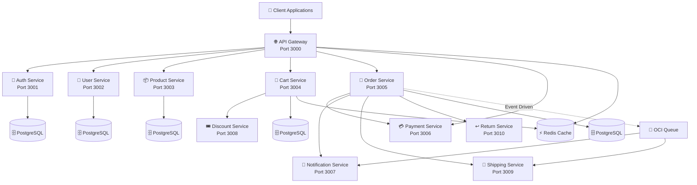

<div align="center">

# 🛒 E-Commerce Microservices Platform

[](https://www.typescriptlang.org/)
[](https://nodejs.org/)
[](https://www.postgresql.org/)
[](https://kubernetes.io/)
[](https://www.docker.com/)
[](https://www.terraform.io/)

**A production-ready, enterprise-grade e-commerce platform built with microservices architecture**

[Features](#-features) • [Architecture](#-architecture) • [Getting Started](#-getting-started) • [Documentation](#-documentation) • [Deployment](#-deployment)

---

[](#-services)
[](#-architecture)
[](#-deployment)
[](#-license)

</div>

---

## 📋 Table of Contents

<details>
<summary>Click to expand</summary>

- [🎯 Overview](#-overview)
- [🏗️ Architecture](#️-architecture)
- [✨ Features](#-features)
- [🛠️ Tech Stack](#️-tech-stack)
- [📁 Project Structure](#-project-structure)
- [🚀 Getting Started](#-getting-started)
- [🔧 Services](#-services)
- [📚 Documentation](#-documentation)
- [🚢 Deployment](#-deployment)
- [🌟 What Makes This Special](#-what-makes-this-special)
- [🎓 Learning Resources](#-learning-resources)
- [🤝 Contributing](#-contributing)

</details>

---

## 🎯 Overview

<div align="center">

**A complete e-commerce platform designed from the ground up using microservices architecture**

</div>

This is a **production-ready** e-commerce platform where each service is independently deployable, scalable, and maintainable. The platform handles everything from user authentication to order fulfillment, payment processing, and shipping management.

### Why This Project?

> **I wanted to create a real-world project that showcases enterprise-level software development practices.**
> 
> This isn't just a tutorial project - it's a production-ready system with:
> - ✅ Proper error handling and validation
> - ✅ Comprehensive logging and monitoring
> - ✅ Security best practices
> - ✅ Infrastructure as Code
> - ✅ Automated CI/CD pipelines
> - ✅ Complete documentation

### Key Highlights

<table>
<tr>
<td width="50%">

#### 🚀 Production Ready
- Fully containerized with Docker
- Kubernetes orchestration
- CI/CD pipelines
- Health checks & monitoring

</td>
<td width="50%">

#### 🏗️ Clean Architecture
- Domain-driven design
- Dependency inversion
- Testable codebase
- Maintainable structure

</td>
</tr>
<tr>
<td width="50%">

#### 🔒 Enterprise Security
- JWT authentication
- Rate limiting
- Input validation
- Secure secrets management

</td>
<td width="50%">

#### 📊 Observability
- Prometheus metrics
- Distributed logging
- Health endpoints
- Performance monitoring

</td>
</tr>
</table>

---

## 🏗️ Architecture

The platform follows a **monorepo microservices architecture** where each service is a directory within this repository. This design enables:

<div align="center">

| 🎯 **Independent Development** | 🚀 **Independent Deployment** | 🔧 **Technology Flexibility** | 📈 **Scalability** |
|:---:|:---:|:---:|:---:|
| Teams can work on different services without blocking each other | Deploy services separately based on business needs | Each service can use the best tool for its job | Scale individual services based on load |

</div>

### High-Level Architecture Diagram



### Communication Patterns

<div align="center">

| Pattern | Technology | Use Case |
|:---:|:---:|:---|
| **🔄 Synchronous** | HTTP/REST | Immediate responses (Gateway → Auth for token validation) |
| **📨 Asynchronous** | OCI Queue/Streaming | Decoupled operations (Order created → Notification sent) |

</div>

---

## ✨ Features

### Core Functionality

<div align="center">

| 🔐 Authentication | 👤 User Management | 📦 Product Catalog | 🛒 Shopping Cart |
|:---:|:---:|:---:|:---:|
| JWT-based auth with refresh tokens<br/>MFA support<br/>Device management | User profiles<br/>Preferences<br/>Address management | Product management<br/>Inventory tracking<br/>Search & filtering | Guest & authenticated carts<br/>Cart persistence |

| 📝 Order Management | 💳 Payment Processing | 📧 Notifications | 🎟️ Discounts |
|:---:|:---:|:---:|:---:|
| Order creation<br/>Status tracking<br/>Order history | Multiple gateways (Stripe, PayPal)<br/>Secure handling | Email (SendGrid)<br/>SMS (Twilio)<br/>Push notifications | Coupon codes<br/>Promotional rules<br/>Discount calculation |

| 🚚 Shipping | ↩️ Returns & Refunds |
|:---:|:---:|
| Rate calculation<br/>Carrier integration<br/>Tracking | Return requests<br/>Refund processing |

</div>

### Enterprise Features

<table>
<tr>
<td>

#### 🔒 Security
- Rate limiting per IP/user
- Input validation & sanitization
- SQL injection prevention
- XSS protection
- Secure secrets management

</td>
<td>

#### 📊 Monitoring & Observability
- Prometheus metrics
- Health checks & readiness probes
- Distributed logging
- Performance monitoring
- Error tracking

</td>
</tr>
<tr>
<td>

#### 🔄 Resilience & Reliability
- Circuit breakers
- Retry logic with exponential backoff
- Graceful degradation
- Timeout handling
- Bulkhead pattern

</td>
<td>

#### 🚀 Scalability
- Horizontal scaling
- Load balancing
- Auto-scaling (HPA)
- Resource quotas
- Connection pooling

</td>
</tr>
<tr>
<td>

#### 🧪 Testing & Quality
- Unit tests
- Integration tests
- API endpoint tests
- Code coverage reports
- E2E testing

</td>
<td>

#### 📚 Documentation
- OpenAPI/Swagger specs
- Comprehensive READMEs
- Architecture diagrams
- API documentation
- Setup guides

</td>
</tr>
</table>

---

## 🛠️ Tech Stack

### Backend Technologies

<div align="center">

| Category | Technologies |
|:---:|:---|
| **🟢 Runtime** | Node.js 22+ |
| **📘 Language** | TypeScript |
| **🌐 Framework** | Express.js |
| **🗄️ Database** | PostgreSQL (via Prisma ORM) |
| **⚡ Cache** | Redis |
| **📨 Message Queue** | OCI Queue/Streaming |

</div>

### Infrastructure & DevOps

<div align="center">

| Category | Technologies |
|:---:|:---|
| **🐳 Containerization** | Docker |
| **☸️ Orchestration** | Kubernetes (Helm) |
| **☁️ Cloud Provider** | Oracle Cloud Infrastructure (OCI) |
| **🏗️ Infrastructure as Code** | Terraform |
| **🔄 CI/CD** | GitHub Actions |

</div>

### Development Tools

<div align="center">

| Category | Tools |
|:---:|:---|
| **📖 API Documentation** | OpenAPI/Swagger |
| **🧪 Testing** | Jest, Supertest |
| **✨ Code Quality** | ESLint, Prettier |
| **📝 Logging** | Winston |
| **📊 Monitoring** | Prometheus |

</div>

---

## 📁 Project Structure

```
Enterprise-Ecommerce-Backend/
├── 🌐 gateway-service/          # API Gateway - routing, auth, rate limiting
├── 🔐 auth-service/             # Authentication & authorization
├── 👤 user-service/             # User management
├── 📦 product-service/          # Product catalog & inventory
├── 🛒 cart-service/             # Shopping cart
├── 📝 order-service/            # Order processing
├── 💳 payment-service/          # Payment processing
├── 📧 notification-service/     # Email, SMS, push notifications
├── 🎟️ discount-service/          # Coupons & promotions
├── 🚚 shipping-service/         # Shipping & tracking
├── ↩️ return-service/            # Returns & refunds
├── 🏗️ infrastructure-service/   # Terraform & Kubernetes configs
│   ├── 01-terraform/            # Infrastructure as Code
│   └── 02-kubernetes/           # Helm charts for deployment
└── 📚 docs/                     # Comprehensive documentation
```

### Clean Architecture Structure

Each service follows **Clean Architecture** principles:

```
service-name/
├── src/
│   ├── domain/           # Domain entities and business logic (no dependencies)
│   ├── application/      # Use cases and application services
│   ├── infrastructure/   # Database, external services, implementations
│   ├── interfaces/       # HTTP routes, middleware, entry points
│   ├── shared/           # Shared utilities and errors
│   └── di/               # Dependency injection container
├── config/               # Environment configs (default, development, staging, production)
├── prisma/               # Database schema and migrations
├── Dockerfile            # Production-ready Docker image
├── docker-compose.yml    # Local development setup
└── package.json          # Dependencies and scripts
```

---

## 🚀 Getting Started

### Prerequisites

Before you start, make sure you have:

<div align="center">

| Requirement | Version | Installation |
|:---:|:---:|:---|
| **Node.js** | >= 22.0.0 | [Download](https://nodejs.org/) |
| **npm** | >= 10.0.0 | Comes with Node.js |
| **Docker** | Latest | [Download](https://www.docker.com/) |
| **Git** | Latest | [Download](https://git-scm.com/) |

</div>

### ⚡ Quick Start

<div align="center">

**Get up and running in 5 minutes!**

</div>

#### 1️⃣ Clone the Repository

```bash
git clone <repository-url>
cd Enterprise-Ecommerce-Backend
```

#### 2️⃣ Choose a Service to Explore

```bash
# Let's start with the auth service
cd auth-service
```

#### 3️⃣ Install Dependencies

```bash
npm install
```

#### 4️⃣ Set Up Environment

```bash
# Services use config files (already present):
# - config/default.json (base configuration)
# - config/development.json (development overrides)
# - config/staging.json (staging overrides)
# - config/production.json (production overrides)

# Set NODE_ENV to use the appropriate config
export NODE_ENV=development

# Optional: Create .env file for local overrides
# cp env.example .env  # if env.example exists
```

#### 5️⃣ Start Infrastructure

```bash
# Start PostgreSQL and Redis
docker compose up -d
```

#### 6️⃣ Set Up Database

```bash
# Generate Prisma client
npm run prisma:generate

# Run database migrations
npm run prisma:migrate
```

#### 7️⃣ Start the Service

```bash
# Development mode with hot reload
npm run dev
```

#### 8️⃣ Test It

```bash
# Health check endpoint
curl http://localhost:3001/health

# Should return: {"status":"ok","service":"auth-service"}
```

### 📖 Want More Details?

Check out the comprehensive documentation:

- 📘 **[Setup Guide](./docs/00-setup/README.md)** - Detailed setup instructions for different platforms
- 🔧 **[Developer Workflow](./docs/03-developer-workflow.md)** - How to develop on this project
- 🏗️ **[Architecture Documentation](./docs/02-codebase-architecture/README.md)** - Deep dive into the architecture
- 📚 **[Complete Documentation](./docs/README.md)** - Full documentation index

---

## 🔧 Services

<div align="center">

**11 Microservices | Each Independently Deployable**

</div>

### 🌐 Gateway Service (Port 3000)

<div align="center">

**The entry point for all client requests**

</div>

| Feature | Description |
|:---:|:---|
| **Routing** | Request routing to backend services |
| **Auth** | JWT token validation |
| **Rate Limiting** | Per IP/user rate limiting |
| **Caching** | Response caching |
| **Circuit Breakers** | Resilience patterns |

---

### 🔐 Auth Service (Port 3001)

<div align="center">

**Handles all authentication and authorization logic**

</div>

| Feature | Description |
|:---:|:---|
| **Registration & Login** | User registration and authentication |
| **JWT Tokens** | Token generation and validation |
| **Refresh Tokens** | Secure token refresh mechanism |
| **MFA** | Multi-factor authentication support |
| **Password Reset** | Secure password reset flow |
| **Device Management** | Session and device tracking |

---

### 👤 User Service (Port 3002)

<div align="center">

**Manages user profiles and user-related data**

</div>

| Feature | Description |
|:---:|:---|
| **Profile Management** | User profile CRUD operations |
| **Address Management** | Multiple shipping/billing addresses |
| **Preferences** | User preferences and settings |
| **Wishlist** | Product wishlist management |
| **Activity Tracking** | User activity history |

---

### 📦 Product Service (Port 3003)

<div align="center">

**Manages the product catalog and inventory**

</div>

| Feature | Description |
|:---:|:---|
| **Product CRUD** | Complete product management |
| **Inventory** | Real-time inventory tracking |
| **Search & Filter** | Advanced search and filtering |
| **Categories** | Category hierarchy management |
| **Reviews & Ratings** | Product review system |
| **Image Management** | Product image handling |

---

### 🛒 Cart Service (Port 3004)

<div align="center">

**Handles shopping cart operations**

</div>

| Feature | Description |
|:---:|:---|
| **Add/Remove Items** | Cart item management |
| **Guest Cart** | Support for unauthenticated users |
| **Cart Persistence** | Save cart across sessions |
| **Calculations** | Price and tax calculations |
| **Expiration** | Automatic cart expiration |

---

### 📝 Order Service (Port 3005)

<div align="center">

**Processes and manages orders**

</div>

| Feature | Description |
|:---:|:---|
| **Order Creation** | Create orders from cart |
| **Status Tracking** | Real-time order status |
| **Order History** | Complete order history |
| **Cancellation** | Order cancellation workflow |
| **Fulfillment** | Order fulfillment process |

---

### 💳 Payment Service (Port 3006)

<div align="center">

**Handles payment processing**

</div>

| Feature | Description |
|:---:|:---|
| **Payment Gateways** | Stripe, PayPal integration |
| **Payment Processing** | Secure payment handling |
| **Refunds** | Refund processing |
| **Payment Methods** | Multiple payment methods |
| **Payment History** | Complete transaction history |

---

### 📧 Notification Service (Port 3007)

<div align="center">

**Sends notifications via multiple channels**

</div>

| Feature | Description |
|:---:|:---|
| **Email** | SendGrid integration |
| **SMS** | Twilio integration |
| **Push Notifications** | Mobile push notifications |
| **Templates** | Notification templates |
| **Preferences** | User notification preferences |

---

### 🎟️ Discount Service (Port 3008)

<div align="center">

**Manages discounts and promotions**

</div>

| Feature | Description |
|:---:|:---|
| **Coupon Codes** | Coupon code management |
| **Promotional Rules** | Complex promotion rules |
| **Discount Calculation** | Automatic discount calculation |
| **Validation** | Discount validation logic |
| **History** | Discount usage history |

---

### 🚚 Shipping Service (Port 3009)

<div align="center">

**Handles shipping calculations and tracking**

</div>

| Feature | Description |
|:---:|:---|
| **Rate Calculation** | Shipping rate calculation |
| **Carrier Support** | Multiple carrier integration |
| **Zone Management** | Shipping zone configuration |
| **Tracking** | Tracking number generation |
| **Status Updates** | Delivery status updates |

---

### ↩️ Return Service (Port 3010)

<div align="center">

**Manages returns and refunds**

</div>

| Feature | Description |
|:---:|:---|
| **Return Requests** | Return request creation |
| **Approval Workflow** | Return approval process |
| **Refunds** | Refund processing |
| **Status Tracking** | Return status tracking |
| **History** | Return history management |

---

## 📚 Documentation

<div align="center">

**Comprehensive documentation for everything**

</div>

### Main Documentation

| Document | Description |
|:---:|:---|
| **[📘 Main Documentation](./docs/README.md)** | Start here for complete documentation |
| **[⚙️ Setup Guides](./docs/00-setup/)** | Platform-specific setup instructions |
| **[🤝 Contributing Guide](./docs/01-contributing/)** | How to contribute to this project |
| **[🏗️ Architecture Docs](./docs/02-codebase-architecture/)** | Architecture deep dive |
| **[💻 Developer Workflow](./docs/03-developer-workflow.md)** | Development practices |
| **[🔗 Service Collaboration](./docs/04-service-collaboration.md)** | How services work together |
| **[🗄️ Database Documentation](./docs/05-database/)** | Database schemas and migrations |
| **[🚢 Deployment Guide](./docs/07-deployment/)** | Production deployment instructions |

### Service Documentation

Each service has its own detailed README with:

- ✅ Service-specific setup instructions
- ✅ API documentation (OpenAPI/Swagger)
- ✅ Architecture details
- ✅ Environment variables
- ✅ Testing instructions

---

## 🚢 Deployment

<div align="center">

**Production-ready deployment on Oracle Cloud Infrastructure (OCI)**

</div>

### Infrastructure Setup

```bash
cd infrastructure-service/01-terraform/foundation

# Initialize Terraform
terraform init

# Review the plan
terraform plan

# Apply the infrastructure
terraform apply
```

### Service Deployment

Each service includes:

- **🐳 Docker Image** - Containerized application
- **☸️ Helm Chart** - Kubernetes deployment configuration
- **🔄 CI/CD Pipeline** - Automated build and deployment

Deploy a service:

```bash
cd infrastructure-service/02-kubernetes/services/<service-name>

# Deploy using Helm
helm upgrade --install <service-name> . -f values-prod.yaml
```

### Production Features

<div align="center">

| Feature | Description |
|:---:|:---|
| **☸️ Kubernetes** | Full Kubernetes orchestration with Helm |
| **📈 Auto-scaling** | Horizontal Pod Autoscaling (HPA) |
| **🛡️ High Availability** | Pod Disruption Budgets (PDB) |
| **🔒 Security** | Network policies and RBAC |
| **📊 Resource Management** | Resource quotas and limits |
| **🏥 Health Checks** | Liveness and readiness probes |
| **📈 Monitoring** | Prometheus metrics and Grafana dashboards |
| **📝 Logging** | Centralized logging with ELK stack |
| **🔐 Secrets** | Secure secrets management via OCI Vault |

</div>

See **[Deployment Guide](./docs/07-deployment/README.md)** for detailed instructions.

---

## 🌟 What Makes This Special

### 🎯 Production-Ready Code

<div align="center">

**This isn't a tutorial project. Every service includes:**

</div>

<table>
<tr>
<td width="50%">

#### ✅ Code Quality
- Proper error handling
- Input validation
- Type safety with TypeScript
- Code formatting (Prettier)
- Linting (ESLint)

</td>
<td width="50%">

#### 📊 Observability
- Comprehensive logging
- Health checks
- Performance monitoring
- Error tracking
- Metrics collection

</td>
</tr>
<tr>
<td width="50%">

#### 🔒 Security
- Authentication & authorization
- Rate limiting
- Input sanitization
- Secure secrets management
- HTTPS/TLS support

</td>
<td width="50%">

#### 🚀 Performance
- Database indexing
- Connection pooling
- Caching strategies
- Async processing
- Resource optimization

</td>
</tr>
</table>

### 🏗️ Clean Architecture

Each service follows Clean Architecture principles:

```
┌─────────────────────────────────────────┐
│         Presentation Layer              │
│      (Routes, Controllers, DTOs)        │
└───────────────┬─────────────────────────┘
                │
┌───────────────▼─────────────────────────┐
│        Application Layer                │
│         (Use Cases, Services)           │
└───────────────┬─────────────────────────┘
                │
┌───────────────▼─────────────────────────┐
│          Domain Layer                   │
│      (Entities, Value Objects)          │
└───────────────┬─────────────────────────┘
                │
┌───────────────▼─────────────────────────┐
│       Infrastructure Layer              │
│   (Database, External APIs, Messaging)  │
└─────────────────────────────────────────┘
```

**Benefits:**
- ✅ Separation of concerns
- ✅ Dependency inversion
- ✅ Highly testable
- ✅ Maintainable structure
- ✅ Technology agnostic

### 🏢 Enterprise Practices

<div align="center">

| Practice | Implementation |
|:---:|:---|
| **🏗️ Infrastructure as Code** | Everything defined in Terraform |
| **🐳 Containerization** | Docker images for all services |
| **☸️ Orchestration** | Kubernetes with Helm charts |
| **🔄 CI/CD** | Automated pipelines for each service |
| **📊 Monitoring** | Prometheus metrics and health checks |
| **📚 Documentation** | Comprehensive docs for everything |

</div>

### 🌍 Real-World Features

- ✅ Multi-payment gateway support (Stripe, PayPal)
- ✅ Multiple notification channels (Email, SMS, Push)
- ✅ Complex business logic (discounts, shipping zones)
- ✅ Event-driven architecture
- ✅ Circuit breakers and resilience patterns
- ✅ Distributed tracing
- ✅ Centralized logging

### 👨‍💻 Developer Experience

- ✅ Clear, comprehensive documentation
- ✅ Easy local setup with Docker Compose
- ✅ Comprehensive testing suite
- ✅ API documentation (OpenAPI/Swagger)
- ✅ Consistent code style across services
- ✅ Hot reload in development
- ✅ Environment variable examples

---

## 🎓 Learning Resources

<div align="center">

**New to microservices? Start here!**

</div>

### Recommended Learning Path

1. **🌐 Start with Gateway Service**
   - Shows routing patterns
   - Demonstrates middleware usage
   - Rate limiting implementation

2. **🔐 Then explore Auth Service**
   - JWT token implementation
   - Authentication patterns
   - Security best practices

3. **📦 Check out Product Service**
   - CRUD operations
   - Search and filtering
   - Database relationships

4. **📝 Review Order Service**
   - Complex workflows
   - Event publishing
   - Service interactions

5. **🏗️ Look at Infrastructure**
   - Terraform configurations
   - Kubernetes deployments
   - CI/CD pipelines

### Key Concepts Demonstrated

- **Microservices Architecture** - Service decomposition and communication
- **Clean Architecture** - Layered architecture and dependency inversion
- **Domain-Driven Design** - Entity modeling and business logic
- **Event-Driven Architecture** - Asynchronous communication patterns
- **Infrastructure as Code** - Terraform for cloud infrastructure
- **Container Orchestration** - Kubernetes deployment patterns
- **Observability** - Logging, metrics, and tracing
- **Security** - Authentication, authorization, and data protection

---

## 🤝 Contributing

<div align="center">

**While this is a portfolio project, I welcome feedback and suggestions!**

</div>

If you find issues or have ideas for improvements, feel free to:

- 🐛 [Open an Issue](../../issues) - Report bugs or suggest features
- 💡 [Start a Discussion](../../discussions) - Share ideas and get feedback
- 📝 [Submit a PR](../../pulls) - Contribute code improvements

---

## 📝 License

This project is for demonstration purposes. Feel free to use it as a reference for your own projects.

---

## 🙏 Acknowledgments

This project demonstrates modern software engineering practices and best practices learned from:

- 📚 Microservices architecture patterns
- 🏗️ Clean Architecture principles
- ☁️ Cloud-native development
- 🔄 DevOps and infrastructure automation
- 📖 Industry best practices and design patterns

---

<div align="center">

### Built with ❤️ to showcase enterprise-level software development

**If you're a recruiter or hiring manager reviewing this project, I'd love to discuss how I can bring these skills to your team!**

---

**⭐ If you found this project helpful, please consider giving it a star!**

[](../../)
[](../../fork)

</div>

---

<div align="center">

**Made with TypeScript, Node.js, and lots of snacks**

[Back to Top](#-e-commerce-microservices-platform)

</div>