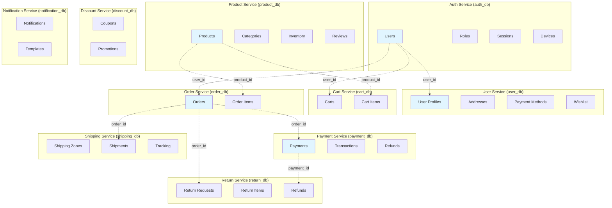

<div align="center">

# 🗄️ Master ER Diagram - Complete E-Commerce System

[](https://www.postgresql.org/)
[](.)
[](.)

**Complete Entity-Relationship diagram showing all databases across all microservices**

</div>

---

This document provides a complete Entity-Relationship diagram showing all databases across all microservices in the e-commerce platform. Each service has its own database, and relationships between services are shown as **logical references** (not database foreign keys).

## Database Per Service Pattern

Each microservice has its own PostgreSQL database:

<div align="center">

**Each microservice has its own PostgreSQL database:**

</div>

| Service | Database | Tables | Description |
|:---:|:---|:---:|:---|
| 🔐 **Auth Service** | `auth_db` | 12 tables | Authentication, authorization, sessions, devices, MFA |
| 👤 **User Service** | `user_db` | 9 tables | User profiles, addresses, payment methods, wishlist |
| 📦 **Product Service** | `product_db` | 14 tables | Products, categories, inventory, reviews, Q&A |
| 🛒 **Cart Service** | `cart_db` | 2 tables | Shopping carts and cart items |
| 📝 **Order Service** | `order_db` | 5 tables | Orders, order items, status history |
| 💳 **Payment Service** | `payment_db` | 7 tables | Payments, transactions, refunds, webhooks |
| 🚚 **Shipping Service** | `shipping_db` | 6 tables | Shipping zones, methods, shipments, tracking |
| ↩️ **Return Service** | `return_db` | 6 tables | Return requests, RMAs, refunds |
| 🎟️ **Discount Service** | `discount_db` | 5 tables | Coupons, promotions, usage tracking |
| 📧 **Notification Service** | `notification_db` | 4 tables | Notifications, templates, preferences |

<div align="center">

**📊 Total**: 10 databases, 70 tables

</div>

## Complete System ER Diagram

### High-Level Service Overview



### Detailed ER Diagram - All Tables

```mermaid
erDiagram
    %% ============================================
    %% AUTH SERVICE DATABASE (auth_db)
    %% ============================================
    AUTH_USERS ||--o{ AUTH_USER_ROLES : "has"
    AUTH_ROLES ||--o{ AUTH_USER_ROLES : "assigned"
    AUTH_USERS ||--o{ AUTH_REFRESH_TOKENS : "has"
    AUTH_USERS ||--o{ AUTH_PASSWORD_RESET_TOKENS : "has"
    AUTH_USERS ||--o{ AUTH_EMAIL_VERIFICATION_TOKENS : "has"
    AUTH_USERS ||--o{ AUTH_SECURITY_AUDIT_LOGS : "generates"
    AUTH_USERS ||--o{ AUTH_DEVICES : "has"
    AUTH_USERS ||--o{ AUTH_LOGIN_HISTORY : "has"
    AUTH_USERS ||--o{ AUTH_USER_SESSIONS : "has"
    AUTH_DEVICES ||--o{ AUTH_REFRESH_TOKENS : "uses"
    AUTH_DEVICES ||--o{ AUTH_LOGIN_HISTORY : "from"
    AUTH_DEVICES ||--o{ AUTH_USER_SESSIONS : "uses"
    AUTH_REFRESH_TOKENS ||--o{ AUTH_USER_SESSIONS : "linked_to"
    
    AUTH_USERS {
        string id PK
        string email UK
        string passwordHash
        boolean emailVerified
        boolean isActive
        int failedLoginAttempts
        datetime lockedUntil
        boolean mfaEnabled
        string mfaSecret
        datetime createdAt
        datetime updatedAt
    }
    
    AUTH_ROLES {
        string id PK
        string name UK
        string description
        datetime createdAt
        datetime updatedAt
    }
    
    AUTH_USER_ROLES {
        string id PK
        string userId FK
        string roleId FK
        datetime createdAt
    }
    
    AUTH_REFRESH_TOKENS {
        string id PK
        string token UK
        string userId FK
        string deviceId FK
        datetime expiresAt
        boolean revoked
        datetime createdAt
    }
    
    AUTH_DEVICES {
        string id PK
        string userId FK
        string deviceId UK
        string deviceName
        string deviceType
        string os
        string browser
        boolean isTrusted
        datetime lastUsedAt
        datetime createdAt
    }
    
    AUTH_USER_SESSIONS {
        string id PK
        string userId FK
        string sessionToken UK
        string refreshTokenId FK
        string deviceId FK
        boolean isActive
        datetime expiresAt
        datetime createdAt
    }
    
    AUTH_LOGIN_HISTORY {
        string id PK
        string userId FK
        string deviceId FK
        string status
        string ipAddress
        datetime createdAt
    }
    
    AUTH_SECURITY_AUDIT_LOGS {
        string id PK
        string userId FK
        string action
        string ipAddress
        json metadata
        datetime createdAt
    }
    
    AUTH_PASSWORD_RESET_TOKENS {
        string id PK
        string token UK
        string userId FK
        datetime expiresAt
        boolean used
        datetime createdAt
    }
    
    AUTH_EMAIL_VERIFICATION_TOKENS {
        string id PK
        string token UK
        string userId FK
        datetime expiresAt
        boolean verified
        datetime createdAt
    }
    
    AUTH_MFA_BACKUP_CODES {
        string id PK
        string userId
        string code
        boolean used
        datetime expiresAt
        datetime createdAt
    }
    
    AUTH_RATE_LIMITS {
        string id PK
        string key UK
        int count
        datetime expiresAt
        datetime createdAt
    }
    
    %% ============================================
    %% USER SERVICE DATABASE (user_db)
    %% ============================================
    USER_PROFILES ||--o{ USER_ADDRESSES : "has"
    USER_PROFILES ||--o{ USER_PAYMENT_METHODS : "has"
    USER_PROFILES ||--o{ USER_PREFERENCES : "has"
    USER_PROFILES ||--o{ USER_WISHLIST_ITEMS : "has"
    USER_PROFILES ||--o{ USER_RECENTLY_VIEWED : "has"
    USER_PROFILES ||--o{ USER_ACTIVITIES : "has"
    USER_PROFILES ||--o{ USER_NOTIFICATION_PREFERENCES : "has"
    
    USER_PROFILES {
        string id PK
        string userId UK "references auth.users.id *logical*"
        string email UK "denormalized"
        string firstName
        string lastName
        string phone
        string avatarUrl
        datetime dateOfBirth
        string gender
        string preferredCurrency
        string preferredLanguage
        boolean newsletterSubscribed
        boolean isActive "synced from auth"
        int profileCompletionScore
        datetime createdAt
        datetime updatedAt
    }
    
    USER_ADDRESSES {
        string id PK
        string userId FK
        string type "shipping|billing|both"
        boolean isDefault
        string firstName
        string lastName
        string addressLine1
        string city
        string postalCode
        string country
        datetime createdAt
        datetime updatedAt
    }
    
    USER_PAYMENT_METHODS {
        string id PK
        string userId FK
        string type "credit_card|paypal|bank_account"
        boolean isDefault
        string cardType
        string last4
        string providerToken "encrypted"
        datetime createdAt
        datetime updatedAt
    }
    
    USER_PREFERENCES {
        string id PK
        string userId FK
        string key UK
        string value
        datetime createdAt
        datetime updatedAt
    }
    
    USER_WISHLIST_ITEMS {
        string id PK
        string userId FK
        string productId "references product.products.id *logical*"
        string productName "denormalized"
        string productImageUrl "denormalized"
        string productPrice "denormalized"
        string notes
        datetime createdAt
        datetime updatedAt
    }
    
    USER_RECENTLY_VIEWED_PRODUCTS {
        string id PK
        string userId FK
        string productId "references product.products.id *logical*"
        string productName "denormalized"
        decimal productPrice "denormalized"
        datetime viewedAt
    }
    
    USER_ACTIVITIES {
        string id PK
        string userId FK
        string activityType
        string entityType
        string entityId
        json metadata
        datetime createdAt
    }
    
    USER_NOTIFICATION_PREFERENCES {
        string id PK
        string userId FK
        string channel "email|sms|push"
        string category
        boolean enabled
        string frequency
        datetime createdAt
        datetime updatedAt
    }
    
    USER_EVENT_LOGS {
        string id PK
        string eventId UK
        string eventType
        string source
        string payload
        boolean processed
        datetime createdAt
    }
    
    %% ============================================
    %% PRODUCT SERVICE DATABASE (product_db)
    %% ============================================
    PRODUCTS ||--o{ PRODUCT_VARIANTS : "has"
    PRODUCTS ||--o{ PRODUCT_IMAGES : "has"
    PRODUCTS ||--o{ PRODUCT_CATEGORIES : "belongs_to"
    PRODUCTS ||--o{ PRODUCT_REVIEWS : "has"
    PRODUCTS ||--o{ PRODUCT_TAGS : "has"
    PRODUCTS ||--|| PRODUCT_INVENTORY : "has"
    PRODUCTS ||--o{ PRODUCT_QUESTIONS : "has"
    PRODUCTS ||--o{ PRODUCT_STOCK_ALERTS : "has"
    PRODUCTS ||--o{ PRODUCT_RECENTLY_VIEWED : "viewed"
    PRODUCTS ||--o{ PRODUCT_PRICE_HISTORY : "has"
    PRODUCTS ||--o{ PRODUCT_SEARCH_HISTORY : "searched"
    CATEGORIES ||--o{ PRODUCT_CATEGORIES : "contains"
    CATEGORIES ||--o{ CATEGORIES : "parent_of"
    PRODUCT_VARIANTS ||--o{ PRODUCT_INVENTORY : "has"
    
    PRODUCTS {
        string id PK
        string sku UK
        string name
        string slug UK
        text description
        decimal price
        decimal compareAtPrice
        string status "draft|active|archived"
        boolean isVisible
        int stockQuantity
        string stockStatus
        decimal weight
        string[] badges
        int viewCount
        int purchaseCount
        datetime createdAt
        datetime updatedAt
    }
    
    PRODUCT_VARIANTS {
        string id PK
        string productId FK
        string sku UK
        string name
        decimal price
        int stockQuantity
        string stockStatus
        json attributes
        datetime createdAt
        datetime updatedAt
    }
    
    PRODUCT_IMAGES {
        string id PK
        string productId FK
        string url
        string altText
        int sortOrder
        boolean isPrimary
        datetime createdAt
    }
    
    CATEGORIES {
        string id PK
        string name
        string slug UK
        string parentId FK
        int level
        int sortOrder
        string imageUrl
        boolean isActive
        datetime createdAt
        datetime updatedAt
    }
    
    PRODUCT_CATEGORIES {
        string id PK
        string productId FK
        string categoryId FK
        datetime createdAt
    }
    
    PRODUCT_INVENTORY {
        string id PK
        string productId FK UK
        string variantId FK
        int quantity
        int reservedQuantity
        int availableQuantity
        string location
        datetime lastRestockedAt
        datetime createdAt
        datetime updatedAt
    }
    
    PRODUCT_REVIEWS {
        string id PK
        string productId FK
        string userId "references auth.users.id *logical*"
        int rating "1-5"
        string title
        text comment
        boolean isVerifiedPurchase
        boolean isApproved
        int helpfulCount
        datetime createdAt
        datetime updatedAt
    }
    
    PRODUCT_TAGS {
        string id PK
        string productId FK
        string tag
        datetime createdAt
    }
    
    PRODUCT_QUESTIONS {
        string id PK
        string productId FK
        string userId "references auth.users.id *logical*"
        text question
        text answer
        string answeredBy
        int upvotes
        boolean isApproved
        datetime createdAt
        datetime updatedAt
    }
    
    PRODUCT_STOCK_ALERTS {
        string id PK
        string productId FK
        string userId "references auth.users.id *logical*"
        string email
        string variantId
        boolean notified
        datetime expiresAt
        datetime createdAt
    }
    
    PRODUCT_RECENTLY_VIEWED {
        string id PK
        string productId FK
        string userId "references auth.users.id *logical*"
        datetime viewedAt
    }
    
    PRODUCT_COMPARISONS {
        string id PK
        string userId "references auth.users.id *logical*"
        string name
        string[] productIds
        datetime createdAt
        datetime updatedAt
    }
    
    PRODUCT_PRICE_HISTORY {
        string id PK
        string productId FK
        decimal price
        decimal compareAtPrice
        string changedBy
        string reason
        datetime createdAt
    }
    
    PRODUCT_SEARCH_HISTORY {
        string id PK
        string productId FK
        string userId "references auth.users.id *logical*"
        string query
        json filters
        int resultsCount
        datetime createdAt
    }
    
    %% ============================================
    %% CART SERVICE DATABASE (cart_db)
    %% ============================================
    CARTS ||--o{ CART_ITEMS : "has"
    
    CARTS {
        string id PK
        string userId "references auth.users.id *logical*"
        string sessionId
        string status "active|abandoned|converted"
        string currency
        decimal subtotal
        decimal taxAmount
        decimal shippingAmount
        decimal discountAmount
        decimal totalAmount
        string couponCode "references discount.coupons.code *logical*"
        datetime expiresAt
        datetime convertedAt
        datetime createdAt
        datetime updatedAt
    }
    
    CART_ITEMS {
        string id PK
        string cartId FK
        string productId "references product.products.id *logical*"
        string variantId "references product.product_variants.id *logical*"
        string productName "denormalized"
        string productSku "denormalized"
        string productImageUrl "denormalized"
        decimal unitPrice "denormalized"
        int quantity
        decimal totalPrice
        json metadata
        datetime createdAt
        datetime updatedAt
    }
    
    %% ============================================
    %% ORDER SERVICE DATABASE (order_db)
    %% ============================================
    ORDERS ||--o{ ORDER_ITEMS : "has"
    ORDERS ||--o{ ORDER_STATUS_HISTORY : "has"
    ORDERS ||--|| ORDER_SHIPPING_ADDRESSES : "has"
    ORDERS ||--o{ ORDER_NOTES : "has"
    
    ORDERS {
        string id PK
        string orderNumber UK
        string userId "references auth.users.id *logical*"
        string status "pending|confirmed|processing|shipped|delivered|cancelled|refunded"
        string paymentStatus "pending|paid|failed|refunded"
        decimal subtotal
        decimal taxAmount
        decimal shippingAmount
        decimal discountAmount
        decimal totalAmount
        string currency
        string paymentMethodId "references payment.payments.id *logical*"
        string shippingMethod
        string trackingNumber
        datetime estimatedDeliveryDate
        datetime shippedAt
        datetime deliveredAt
        datetime cancelledAt
        json metadata
        datetime createdAt
        datetime updatedAt
    }
    
    ORDER_ITEMS {
        string id PK
        string orderId FK
        string productId "references product.products.id *logical*"
        string variantId "references product.product_variants.id *logical*"
        string productName "snapshot"
        string productSku "snapshot"
        string productImageUrl "snapshot"
        decimal unitPrice "snapshot"
        int quantity
        decimal totalPrice
        datetime createdAt
    }
    
    ORDER_STATUS_HISTORY {
        string id PK
        string orderId FK
        string status
        string previousStatus
        string changedBy
        string reason
        datetime createdAt
    }
    
    ORDER_SHIPPING_ADDRESSES {
        string id PK
        string orderId FK UK
        string firstName
        string lastName
        string addressLine1
        string city
        string postalCode
        string country
        datetime createdAt
    }
    
    ORDER_NOTES {
        string id PK
        string orderId FK
        text note
        string createdBy
        boolean isInternal
        datetime createdAt
    }
    
    %% ============================================
    %% PAYMENT SERVICE DATABASE (payment_db)
    %% ============================================
    PAYMENTS ||--o{ PAYMENT_TRANSACTIONS : "has"
    PAYMENTS ||--o{ PAYMENT_REFUNDS : "has"
    PAYMENTS ||--o{ PAYMENT_WEBHOOKS : "has"
    PAYMENTS ||--o| PAYMENT_METHODS : "uses"
    
    PAYMENTS {
        string id PK
        string orderId "references order.orders.id *logical*"
        string userId "references auth.users.id *logical*"
        string paymentMethodId FK
        string status "PENDING|PROCESSING|SUCCEEDED|FAILED|CANCELLED|REFUNDED"
        string paymentProvider "STRIPE|PAYPAL|MOCK"
        string providerPaymentId UK
        decimal amount
        string currency
        string description
        json metadata
        datetime processedAt
        datetime createdAt
        datetime updatedAt
    }
    
    PAYMENT_TRANSACTIONS {
        string id PK
        string paymentId FK
        string transactionType "CHARGE|REFUND|VOID"
        string status "PENDING|SUCCEEDED|FAILED"
        string providerTransactionId
        decimal amount
        string currency
        json providerResponse
        datetime processedAt
        datetime createdAt
    }
    
    PAYMENT_REFUNDS {
        string id PK
        string paymentId FK
        string orderId "references order.orders.id *logical*"
        string reason
        decimal amount
        string currency
        string status "PENDING|PROCESSING|COMPLETED|FAILED"
        string providerRefundId
        json metadata
        datetime processedAt
        datetime createdAt
        datetime updatedAt
    }
    
    PAYMENT_METHODS {
        string id PK
        string userId "references auth.users.id *logical*"
        string type "CREDIT_CARD|DEBIT_CARD|PAYPAL"
        string provider "STRIPE|PAYPAL|MOCK"
        string providerToken "encrypted"
        string last4
        string cardType
        string expiryMonth
        string expiryYear
        boolean isDefault
        datetime createdAt
        datetime updatedAt
    }
    
    PAYMENT_WEBHOOKS {
        string id PK
        string provider "STRIPE|PAYPAL|MOCK"
        string eventType
        string providerEventId UK
        json payload
        string status "PENDING|PROCESSED|FAILED"
        string paymentId FK
        string error
        datetime processedAt
        datetime createdAt
    }
    
    PAYMENT_IDEMPOTENCY_KEYS {
        string id PK
        string key UK
        string paymentId
        string userId
        datetime expiresAt
        datetime createdAt
    }
    
    PAYMENT_AUDIT_LOGS {
        string id PK
        string eventType
        string userId
        string paymentId
        string orderId
        decimal amount
        string currency
        string ipAddress
        boolean success
        string error
        datetime timestamp
    }
    
    %% ============================================
    %% SHIPPING SERVICE DATABASE (shipping_db)
    %% ============================================
    SHIPPING_ZONES ||--o{ SHIPPING_METHODS : "has"
    SHIPPING_METHODS ||--o{ SHIPPING_RATES : "has"
    SHIPPING_METHODS ||--o{ SHIPMENTS : "uses"
    SHIPMENTS ||--o{ SHIPMENT_TRACKING : "has"
    CARRIERS ||--o{ SHIPMENTS : "uses"
    
    SHIPPING_ZONES {
        string id PK
        string name
        string type "country|state|postal_code|custom"
        json countries
        json states
        json postalCodes
        boolean isActive
        datetime createdAt
        datetime updatedAt
    }
    
    SHIPPING_METHODS {
        string id PK
        string zoneId FK
        string name
        string carrier "fedex|ups|dhl|usps|custom"
        string serviceType "standard|express|overnight"
        decimal basePrice
        decimal pricePerKg
        decimal pricePerItem
        int estimatedDays
        boolean isActive
        json configuration
        datetime createdAt
        datetime updatedAt
    }
    
    SHIPPING_RATES {
        string id PK
        string methodId FK
        decimal minWeight
        decimal maxWeight
        decimal minAmount
        decimal maxAmount
        decimal rate
        datetime createdAt
        datetime updatedAt
    }
    
    SHIPMENTS {
        string id PK
        string orderId "references order.orders.id *logical*"
        string carrierId FK
        string methodId FK
        string trackingNumber UK
        string status "pending|in_transit|out_for_delivery|delivered|exception"
        decimal weight
        decimal cost
        json originAddress
        json destinationAddress
        datetime shippedAt
        datetime estimatedDeliveryDate
        datetime deliveredAt
        json carrierResponse
        datetime createdAt
        datetime updatedAt
    }
    
    SHIPMENT_TRACKING {
        string id PK
        string shipmentId FK
        string status
        string location
        text description
        datetime timestamp
        json carrierData
        datetime createdAt
    }
    
    CARRIERS {
        string id PK
        string name
        string code UK "fedex|ups|dhl|usps"
        string apiEndpoint
        string apiKey "encrypted"
        boolean isActive
        json configuration
        datetime createdAt
        datetime updatedAt
    }
    
    %% ============================================
    %% RETURN SERVICE DATABASE (return_db)
    %% ============================================
    RETURN_REQUESTS ||--o{ RETURN_ITEMS : "has"
    RETURN_REQUESTS ||--|| RETURN_AUTHORIZATIONS : "has"
    RETURN_REQUESTS ||--o{ RETURN_STATUS_HISTORY : "has"
    RETURN_REQUESTS ||--o{ RETURN_REFUNDS : "has"
    RETURN_AUTHORIZATIONS ||--o{ RETURN_TRACKING : "has"
    
    RETURN_REQUESTS {
        string id PK
        string orderId "references order.orders.id *logical*"
        string userId "references auth.users.id *logical*"
        string rmaNumber UK
        string status "pending|approved|rejected|in_transit|received|processed|closed"
        string returnReason "defective|wrong_item|not_as_described|changed_mind|other"
        text returnNotes
        string refundMethod "original_payment|store_credit|exchange"
        decimal refundAmount
        string currency
        datetime requestedAt
        datetime approvedAt
        datetime rejectedAt
        datetime receivedAt
        datetime processedAt
        datetime closedAt
        json metadata
        datetime createdAt
        datetime updatedAt
    }
    
    RETURN_ITEMS {
        string id PK
        string returnRequestId FK
        string orderItemId "references order.order_items.id *logical*"
        string productId "references product.products.id *logical*"
        string variantId "references product.product_variants.id *logical*"
        string productName
        string productSku
        int quantity
        decimal unitPrice
        decimal refundAmount
        string returnReason
        string condition "new|used|damaged|defective"
        datetime createdAt
        datetime updatedAt
    }
    
    RETURN_AUTHORIZATIONS {
        string id PK
        string returnRequestId FK UK
        string rmaNumber UK
        json returnAddress
        text returnInstructions
        string trackingNumber
        datetime expiresAt
        datetime createdAt
        datetime updatedAt
    }
    
    RETURN_STATUS_HISTORY {
        string id PK
        string returnRequestId FK
        string status
        string previousStatus
        string changedBy
        text notes
        datetime createdAt
    }
    
    RETURN_TRACKING {
        string id PK
        string authorizationId FK
        string status
        string location
        text description
        datetime timestamp
        json carrierData
        datetime createdAt
    }
    
    RETURN_REFUNDS {
        string id PK
        string returnRequestId FK
        string paymentId "references payment.payments.id *logical*"
        string orderId "references order.orders.id *logical*"
        string userId "references auth.users.id *logical*"
        string refundMethod "original_payment|store_credit"
        decimal amount
        string currency
        string status "pending|processing|completed|failed"
        string reason
        datetime processedAt
        datetime createdAt
        datetime updatedAt
    }
    
    %% ============================================
    %% DISCOUNT SERVICE DATABASE (discount_db)
    %% ============================================
    COUPONS ||--o{ COUPON_USAGE : "has"
    PROMOTIONS ||--o{ PROMOTION_RULES : "has"
    PROMOTIONS ||--o{ PROMOTION_USAGE : "has"
    
    COUPONS {
        string id PK
        string code UK
        string name
        text description
        string type "PERCENTAGE|FIXED_AMOUNT|FREE_SHIPPING"
        decimal discountValue
        decimal minimumAmount
        decimal maximumDiscount
        string currency
        int usageLimit
        int usageCount
        int usageLimitPerUser
        datetime startsAt
        datetime endsAt
        boolean isActive
        json applicableProducts
        json applicableCategories
        json excludedProducts
        json metadata
        datetime createdAt
        datetime updatedAt
    }
    
    COUPON_USAGE {
        string id PK
        string couponId FK
        string userId "references auth.users.id *logical*"
        string orderId "references order.orders.id *logical*"
        decimal discountAmount
        datetime usedAt
        datetime createdAt
    }
    
    PROMOTIONS {
        string id PK
        string name
        text description
        string type "BUY_X_GET_Y|BUNDLE|VOLUME_DISCOUNT"
        string status "DRAFT|ACTIVE|PAUSED|EXPIRED"
        datetime startsAt
        datetime endsAt
        boolean isActive
        json configuration
        json metadata
        datetime createdAt
        datetime updatedAt
    }
    
    PROMOTION_RULES {
        string id PK
        string promotionId FK
        string ruleType
        json conditions
        json actions
        int priority
        datetime createdAt
        datetime updatedAt
    }
    
    PROMOTION_USAGE {
        string id PK
        string promotionId FK
        string userId "references auth.users.id *logical*"
        string orderId "references order.orders.id *logical*"
        decimal discountAmount
        datetime usedAt
        datetime createdAt
    }
    
    %% ============================================
    %% NOTIFICATION SERVICE DATABASE (notification_db)
    %% ============================================
    NOTIFICATIONS ||--o| EMAIL_TEMPLATES : "uses"
    NOTIFICATIONS ||--|| NOTIFICATION_LOGS : "has"
    
    NOTIFICATIONS {
        string id PK
        string userId "references auth.users.id *logical*"
        string type "EMAIL|SMS|PUSH|IN_APP"
        string templateId FK
        string subject
        text body
        string status "PENDING|SENT|DELIVERED|FAILED|BOUNCED"
        json metadata
        datetime scheduledAt
        datetime sentAt
        datetime deliveredAt
        datetime createdAt
        datetime updatedAt
    }
    
    EMAIL_TEMPLATES {
        string id PK
        string name UK
        string subject
        text bodyHtml
        text bodyText
        json variables
        boolean isActive
        datetime createdAt
        datetime updatedAt
    }
    
    NOTIFICATION_PREFERENCES {
        string id PK
        string userId "references auth.users.id *logical*"
        string notificationType
        boolean emailEnabled
        boolean smsEnabled
        boolean pushEnabled
        datetime createdAt
        datetime updatedAt
    }
    
    NOTIFICATION_LOGS {
        string id PK
        string notificationId FK UK
        string status "SENT|DELIVERED|FAILED|BOUNCED"
        string provider
        string providerMessageId
        json providerResponse
        string error
        datetime createdAt
    }
    
    %% ============================================
    %% CROSS-SERVICE LOGICAL REFERENCES
    %% ============================================
    AUTH_USERS ||--o| USER_PROFILES : "has_profile *logical*"
    AUTH_USERS ||--o{ ORDERS : "places *logical*"
    AUTH_USERS ||--o{ CARTS : "has *logical*"
    AUTH_USERS ||--o{ PAYMENTS : "makes *logical*"
    AUTH_USERS ||--o{ RETURN_REQUESTS : "creates *logical*"
    AUTH_USERS ||--o{ PRODUCT_REVIEWS : "writes *logical*"
    AUTH_USERS ||--o{ NOTIFICATIONS : "receives *logical*"
    AUTH_USERS ||--o{ COUPON_USAGE : "uses *logical*"
    
    PRODUCTS ||--o{ ORDER_ITEMS : "ordered_as *logical*"
    PRODUCTS ||--o{ CART_ITEMS : "in_cart *logical*"
    PRODUCTS ||--o{ RETURN_ITEMS : "returned_as *logical*"
    PRODUCTS ||--o{ USER_WISHLIST_ITEMS : "wishlisted *logical*"
    
    ORDERS ||--o| PAYMENTS : "paid_by *logical*"
    ORDERS ||--o{ SHIPMENTS : "shipped_as *logical*"
    ORDERS ||--o{ RETURN_REQUESTS : "returned_as *logical*"
    ORDERS ||--o{ COUPON_USAGE : "uses_coupon *logical*"
    
    PAYMENTS ||--o{ RETURN_REFUNDS : "refunded_as *logical*"
```

## Key Relationships

### Logical References (Not Database Foreign Keys)

Services reference each other using:

1. **ID Strings**: Stored as VARCHAR fields
   - Example: `orders.user_id` contains `auth.users.id` as string
   - No database-level foreign key constraints

2. **Event-Driven Communication**: For data synchronization
   - Example: `user.created` event → User Service creates profile

3. **HTTP API Calls**: For validation and real-time checks
   - Example: Order Service validates product exists via Product Service API

## Cross-Service Reference Summary

| From Service | To Service | Reference Count | Primary Use Cases |
|--------------|------------|------------------|-------------------|
| User Service | Auth Service | 1 | User profile sync (`user_id`) |
| User Service | Product Service | 2 | Wishlist items, recently viewed |
| Cart Service | Auth Service | 1 | Cart ownership (`user_id`) |
| Cart Service | Product Service | 2 | Cart items (`product_id`, `variant_id`) |
| Cart Service | Discount Service | 1 | Coupon codes |
| Order Service | Auth Service | 1 | Order ownership (`user_id`) |
| Order Service | Product Service | 2 | Order items (`product_id`, `variant_id`) |
| Order Service | Payment Service | 1 | Payment method (`payment_method_id`) |
| Order Service | Discount Service | 1 | Coupon codes |
| Payment Service | Order Service | 2 | Payment/refund links (`order_id`) |
| Payment Service | Auth Service | 1 | Payment ownership (`user_id`) |
| Shipping Service | Order Service | 1 | Shipment tracking (`order_id`) |
| Return Service | Order Service | 3 | Return requests, items, refunds |
| Return Service | Auth Service | 2 | Return ownership (`user_id`) |
| Return Service | Product Service | 2 | Return items (`product_id`, `variant_id`) |
| Return Service | Payment Service | 1 | Refund processing (`payment_id`) |
| Product Service | Auth Service | 3 | Reviews, questions, stock alerts |
| Notification Service | Auth Service | 1 | Notification delivery (`user_id`) |
| Discount Service | Auth Service | 2 | Coupon/promotion usage (`user_id`) |
| Discount Service | Order Service | 2 | Coupon/promotion usage (`order_id`) |

**Total Cross-Service References**: 25+

See [Cross-Service References](./03-cross-service-references.md) for complete details.

## Database Statistics

### By Service

| Service | Tables | Relationships | Cross-Service Refs |
|---------|--------|---------------|-------------------|
| Auth Service | 12 | 9 internal | 0 (source) |
| User Service | 9 | 7 internal | 2 |
| Product Service | 15 | 12 internal | 3 |
| Cart Service | 2 | 1 internal | 3 |
| Order Service | 5 | 4 internal | 4 |
| Payment Service | 7 | 4 internal | 2 |
| Shipping Service | 6 | 5 internal | 1 |
| Return Service | 6 | 5 internal | 4 |
| Discount Service | 5 | 3 internal | 2 |
| Notification Service | 4 | 2 internal | 1 |

**Total**: 70 tables, 52 internal relationships, 25+ cross-service references

## Database Isolation

### Benefits
- ✅ **Data Independence**: Each service owns its data
- ✅ **Independent Scaling**: Scale databases independently
- ✅ **Technology Flexibility**: Different databases per service if needed
- ✅ **Fault Isolation**: Database issues don't affect other services

### Trade-offs
- ⚠️ **No ACID Transactions**: Across services *use eventual consistency*
- ⚠️ **Data Duplication**: Some data duplicated for performance
- ⚠️ **Eventual Consistency**: Data consistency via events

## Production Design

### Database Configuration
- **PostgreSQL 16+**: All databases
- **Connection Pooling**: PgBouncer recommended
- **Backups**: Daily automated backups
- **Replication**: Read replicas for read-heavy workloads
- **Monitoring**: Database performance monitoring

### Scaling Strategies
- **Vertical Scaling**: Upgrade instance sizes
- **Horizontal Scaling**: Read replicas
- **Partitioning**: Partition large tables by date
- **Indexing**: Proper indexes on foreign key columns

## Individual Service Schemas

For detailed schema documentation, see:
- [Service Schemas](./service-schemas/)

Each service schema document includes:
- Complete table definitions
- Field descriptions
- Indexes and constraints
- Relationships
- Mermaid ER diagrams

---

**Next**: Review [Individual Service Schemas](./service-schemas/) or [Cross-Service References](./03-cross-service-references.md)
