# 🏛️ OCI Production Architecture - Complete Master Diagram

**Single Source of Truth for E-Commerce Platform**

**Primary Region: IN-HYDERABAD-1 | DR Region: IN-MUMBAI-1**

---

> **This is the comprehensive master architecture diagram containing all production features, disaster recovery, high availability, backup strategies, and operational procedures. This document serves as the single source of truth for understanding the entire e-commerce platform infrastructure.**

## Traffic Flow Diagram

## Event-Driven Architecture Flow

## Scalability Architecture

## Security Architecture

## Monitoring & Observability

## Capacity Summary

## Disaster Recovery Architecture

## High Availability Architecture

## Backup & Recovery Strategy

## Disaster Recovery Procedures

## RTO/RPO Targets & SLAs

## Production Requirements Summary

```mermaid
graph TB
    subgraph Production["Production Requirements"]
        subgraph HA_Req["High Availability"]
            HA1["✅ Multi-AZ: 3 Availability Domains"]
            HA2["✅ Automatic Failover: < 5 minutes"]
            HA3["✅ Zero Data Loss: Single/Multiple AD failures"]
            HA4["✅ Load Balancing: Multi-AD distribution"]
            HA5["✅ Pod Disruption Budgets: minAvailable 1-2"]
        end
        
        subgraph DR_Req["Disaster Recovery"]
            DR1["✅ Cross-Region DR: Mumbai (IN-MUMBAI-1)"]
            DR2["✅ RTO: < 1 hour for regional disasters"]
            DR3["✅ RPO: < 15 minutes for regional disasters"]
            DR4["✅ Automated Backup & Replication"]
            DR5["✅ Point-in-Time Recovery: 30-day window"]
        end
        
        subgraph Backup_Req["Backup & Recovery"]
            B1["✅ Daily Full Backups: 02:00 UTC"]
            B2["✅ Hourly Incremental Backups"]
            B3["✅ 30-day Retention (configurable to 60)"]
            B4["✅ Cross-Region Backup Replication"]
            B5["✅ Automated Backup Integrity Verification"]
        end
        
        subgraph Monitor_Req["Monitoring & Alerting"]
            M1["✅ Real-time Replication Lag Monitoring"]
            M2["✅ DR Infrastructure Health Monitoring"]
            M3["✅ Automated Failover Readiness Checks"]
            M4["✅ Backup Success/Failure Alerts"]
            M5["✅ Critical Alerts: SMS + Email"]
        end
        
        subgraph Test_Req["Testing & Validation"]
            T1["✅ Quarterly DR Drills"]
            T2["✅ Monthly Backup Verification"]
            T3["✅ Continuous Replication Monitoring"]
            T4["✅ Automated Failover Testing"]
        end
        
        subgraph Security_Req["Security & Compliance"]
            S1["✅ Encrypted Backups: AES-256 at rest, TLS in transit"]
            S2["✅ Secure Cross-Region Data Transfer"]
            S3["✅ Access Controls for DR Procedures"]
            S4["✅ Audit Logs for All DR Operations"]
        end
    end
    
    HA_Req --> DR_Req
    DR_Req --> Backup_Req
    Backup_Req --> Monitor_Req
    Monitor_Req --> Test_Req
    Test_Req --> Security_Req
    
    style HA1 fill:#c8e6c9,stroke:#2e7d32,stroke-width:2px
    style DR1 fill:#ffccbc,stroke:#d84315,stroke-width:2px
    style B1 fill:#fff9c4,stroke:#f57f17,stroke-width:2px
    style M1 fill:#e1f5ff,stroke:#01579b,stroke-width:2px
```

## Database Replication Topology

## Complete Production Features Checklist

### ✅ Infrastructure Components
- **Primary Region**: IN-HYDERABAD-1 (India Central)
  - 3 Availability Domains (AD-1, AD-2, AD-3)
  - OKE Cluster with 50+ nodes
  - 11 Microservices (100+ pods)
  - 10 Primary Databases + 20 Read Replicas
  - Redis Cluster (3-10 nodes)
  - Load Balancer (100 Mbps - 10 Gbps)
  - OCI Streaming & Queue
  - Container Registry (11 repositories)

- **DR Region**: IN-MUMBAI-1 (India West)
  - 10 Standby Databases (read-only)
  - OKE Cluster (scaled down, ready to scale up)
  - Pre-configured VCN and networking
  - Cross-region backup storage

### ✅ High Availability Features
- Multi-AZ deployment across 3 Availability Domains
- Automatic failover within region (< 5 minutes)
- Zero data loss for single/multiple AD failures
- Read replicas for read scaling (2-5 per database)
- Pod Disruption Budgets (minAvailable: 1-2)
- Health checks (liveness, readiness probes)
- Circuit breakers for cascade failure prevention
- Redis High Availability (master-replica, auto-failover)

### ✅ Disaster Recovery Features
- Cross-region DR to Mumbai (IN-MUMBAI-1)
- RTO: < 1 hour for regional disasters
- RPO: < 15 minutes for regional disasters
- Automated cross-region replication
- Pre-configured DR infrastructure
- DNS failover capability
- DR testing schedule (quarterly drills)

### ✅ Backup & Recovery Features
- Daily full backups (02:00 UTC)
- Hourly incremental backups
- 30-day retention (configurable to 60 days)
- Point-in-Time Recovery (30-day window, 1-second granularity)
- Cross-region backup replication
- Automated backup integrity verification
- Encrypted backups (AES-256 at rest, TLS in transit)

### ✅ Security Features
- WAF (DDoS protection: 10 Tbps)
- SQL Injection & XSS protection
- Rate limiting (2000 req/5min/IP)
- KMS Vault (AES-256 encryption)
- OCI Vault (secrets management)
- IAM (dynamic groups, least privilege)
- Network policies (default deny all)
- mTLS for database connections

### ✅ Monitoring & Observability
- OCI Monitoring (real-time metrics)
- Custom alarms (CPU, Memory, Errors)
- OCI Notifications (Email, SMS alerts)
- VCN Flow Logs (90-day retention)
- Service Logs (90-day retention)
- Replication lag monitoring
- DR infrastructure health monitoring
- Backup success/failure alerts

### ✅ Scalability Features
- Horizontal Pod Autoscaler (2-20 replicas per service)
- Cluster Autoscaler (3-50 nodes per pool)
- Database Auto-scaling (2-128 OCPUs)
- Load Balancer Auto-scaling (100 Mbps - 10 Gbps)
- Redis Auto-scaling (3-10+ nodes)
- Streaming Auto-scaling (1-20 partitions per stream)

### ✅ Performance Features
- CDN (200+ edge locations, < 50ms latency)
- Redis Caching (80-90% DB load reduction)
- Read Replicas (5-10x read capacity)
- Connection pooling
- Event-driven architecture
- Async message processing

### ✅ Cost Management
- Cost tracking by service, environment, resource
- Budget alerts
- Usage reports (daily, monthly)
- Resource tagging for cost allocation

---

## Quick Reference: Key Metrics

| Metric | Target | Description |
|--------|--------|-------------|
| **Uptime** | 99.9% | 8.76 hours/year downtime |
| **Data Availability** | 99.99% | 52.56 minutes/year |
| **RTO (Single AD)** | < 5 min | Automatic failover |
| **RTO (Regional)** | < 1 hour | DR failover |
| **RPO (Single AD)** | 0 sec | Zero data loss |
| **RPO (Regional)** | < 15 min | Last replication |
| **Replication Lag (HA)** | < 1 sec | Within region |
| **Replication Lag (DR)** | < 15 min | Cross-region |
| **Backup Retention** | 30 days | Configurable to 60 |
| **PITR Window** | 30 days | 1-second granularity |

---

**This document is the single source of truth for the e-commerce platform architecture. All production features, disaster recovery procedures, high availability configurations, and operational requirements are documented here.**

