# 🏛️ Master Architecture Diagram - Multi-Environment OCI Infrastructure

**India Region (IN-HYDERABAD-1)**

---

Complete multi-environment architecture showing Production, Staging, and Development environments with complete isolation.

## Multi-Environment Architecture Overview

```mermaid
graph TB
    subgraph OCI["🔷 Oracle Cloud Infrastructure OCI"]
        subgraph Tenancy["Tenancy: ecommerce-tenancy"]
            
            subgraph ProdComp["🔴 Production Compartment<br/>ecommerce-production"]
                subgraph ProdVCN["Production VCN<br/>10.0.0.0/16"]
                    ProdNetwork["🌐 Networking<br/>See: 02-networking-vcn-subnets.md"]
                    ProdIAM["🔐 IAM<br/>See: 03-iam-roles-policies.md"]
                    ProdCompute["💻 OKE Cluster<br/>See: 05-compute-oke-cluster.md"]
                    ProdData["💾 Databases & Redis<br/>See: 06-data-databases.md"]
                    ProdSecurity["🛡️ WAF & KMS<br/>See: 04-security-*.md"]
                    ProdMessaging["📨 Streaming & Queue<br/>See: 07-messaging-streaming-queue.md"]
                end
            end
            
            subgraph StagingComp["🟠 Staging Compartment<br/>ecommerce-staging"]
                subgraph StagingVCN["Staging VCN<br/>10.1.0.0/16"]
                    StagingNetwork["🌐 Networking<br/>10.1.0.0/16"]
                    StagingIAM["🔐 IAM<br/>Staging roles"]
                    StagingCompute["💻 OKE Cluster<br/>3-20 nodes"]
                    StagingData["💾 Databases & Redis<br/>Smaller scale"]
                    StagingMessaging["📨 Streaming & Queue<br/>Staging streams"]
                end
            end
            
            subgraph DevComp["🟢 Development Compartment<br/>ecommerce-development"]
                subgraph DevVCN["Development VCN<br/>10.2.0.0/16"]
                    DevNetwork["🌐 Networking<br/>10.2.0.0/16"]
                    DevIAM["🔐 IAM<br/>Dev roles"]
                    DevCompute["💻 OKE Cluster<br/>1-5 nodes"]
                    DevData["💾 Databases & Redis<br/>Minimal scale"]
                    DevMessaging["📨 Streaming & Queue<br/>Dev streams"]
                end
            end
            
            subgraph SecurityLayer["🛡️ Security Layer (Tenancy Level)"]
                ProdProtection["Production Protection Policy<br/>DENY all access to prod<br/>from staging and dev"]
            end
        end
    end
    
    %% Environment connections
    ProdVCN --> ProdNetwork
    ProdVCN --> ProdIAM
    ProdVCN --> ProdCompute
    ProdVCN --> ProdData
    
    StagingVCN --> StagingNetwork
    StagingVCN --> StagingIAM
    StagingVCN --> StagingCompute
    StagingVCN --> StagingData
    
    DevVCN --> DevNetwork
    DevVCN --> DevIAM
    DevVCN --> DevCompute
    DevVCN --> DevData
    
    %% Security boundaries - NO connections
    StagingComp -.->|"❌ BLOCKED"| ProdComp
    DevComp -.->|"❌ BLOCKED"| ProdComp
    DevComp -.->|"✅ Read-only"| StagingComp
    
    %% Security enforcement
    SecurityLayer --> ProdComp
    SecurityLayer --> StagingComp
    SecurityLayer --> DevComp
    
    %% Styling
    style ProdComp fill:#c62828,stroke:#b71c1c,stroke-width:4px,color:#fff
    style StagingComp fill:#f57c00,stroke:#e65100,stroke-width:3px,color:#fff
    style DevComp fill:#4caf50,stroke:#2e7d32,stroke-width:3px,color:#fff
    style SecurityLayer fill:#ff0000,stroke:#cc0000,stroke-width:4px,color:#fff
```

## Environment Comparison

```mermaid
graph LR
    subgraph Prod["🔴 Production"]
        ProdScale["Full Scale<br/>3-50 nodes<br/>2-128 OCPUs<br/>3-10 Redis nodes"]
        ProdSec["Strict Security<br/>No external access<br/>Isolated VCN"]
        ProdCost["High Cost<br/>Full infrastructure"]
    end
    
    subgraph Staging["🟠 Staging"]
        StagingScale["Medium Scale<br/>3-20 nodes<br/>2-16 OCPUs<br/>3-5 Redis nodes"]
        StagingSec["Moderate Security<br/>No prod access<br/>Isolated VCN"]
        StagingCost["Medium Cost<br/>Reduced infrastructure"]
    end
    
    subgraph Dev["🟢 Development"]
        DevScale["Minimal Scale<br/>1-5 nodes<br/>2-4 OCPUs<br/>1-3 Redis nodes"]
        DevSec["Relaxed Security<br/>No prod access<br/>SSH allowed"]
        DevCost["Low Cost<br/>Minimal infrastructure"]
    end
    
    style Prod fill:#c62828,stroke:#b71c1c,stroke-width:3px,color:#fff
    style Staging fill:#f57c00,stroke:#e65100,stroke-width:3px,color:#fff
    style Dev fill:#4caf50,stroke:#2e7d32,stroke-width:3px,color:#fff
```

## Production Environment Details

## Staging Environment Details

```mermaid
graph TB
    subgraph Staging["🟠 Staging Environment"]
        subgraph StagingInfra["Staging Infrastructure"]
            StagingVCN_Detail["VCN: 10.1.0.0/16<br/>3 Availability Domains<br/>9 Subnets"]
            StagingOKE["OKE Cluster<br/>3-20 nodes<br/>11 Microservices"]
            StagingDB["10 Databases<br/>2-16 OCPUs each<br/>10 Read Replicas"]
            StagingRedis["Redis Cluster<br/>3-5 nodes"]
            StagingLB["Load Balancer<br/>10-1000 Mbps"]
        end
        
        subgraph StagingIAM_Detail["Staging IAM"]
            StagingRoles["Roles: Admin, Developer, Viewer<br/>NO Production Access"]
            StagingPolicy["Policy: Full access to staging<br/>BLOCKS production"]
        end
        
        subgraph StagingSec_Detail["Staging Security"]
            StagingIsolation["Isolated from Production<br/>Read-only for Dev"]
        end
    end
    
    StagingInfra --> StagingIAM_Detail
    StagingIAM_Detail --> StagingSec_Detail
    
    style Staging fill:#f57c00,stroke:#e65100,stroke-width:3px,color:#fff
```

## Development Environment Details

## Security Isolation Matrix

```mermaid
graph TB
    subgraph Isolation["Environment Isolation Matrix"]
        subgraph ProdIsolation["Production Isolation"]
            ProdBlock1["❌ Block Staging Access<br/>DENY 10.1.0.0/16 → 10.0.0.0/16"]
            ProdBlock2["❌ Block Dev Access<br/>DENY 10.2.0.0/16 → 10.0.0.0/16"]
            ProdBlock3["❌ Block External Users<br/>DENY non-prod users"]
        end
        
        subgraph StagingIsolation["Staging Isolation"]
            StagingBlock1["❌ Block Prod Access<br/>DENY 10.1.0.0/16 → 10.0.0.0/16"]
            StagingAllow1["✅ Allow Dev Read<br/>ALLOW 10.2.0.0/16 → 10.1.0.0/16<br/>(Read-only)"]
        end
        
        subgraph DevIsolation["Development Isolation"]
            DevBlock1["❌ Block Prod Access<br/>DENY 10.2.0.0/16 → 10.0.0.0/16"]
            DevAllow1["✅ Allow Staging Read<br/>ALLOW 10.2.0.0/16 → 10.1.0.0/16<br/>(Read-only)"]
        end
    end
    
    style ProdIsolation fill:#ff0000,stroke:#cc0000,stroke-width:3px,color:#fff
    style StagingIsolation fill:#f57c00,stroke:#e65100,stroke-width:3px,color:#fff
    style DevIsolation fill:#4caf50,stroke:#2e7d32,stroke-width:3px,color:#fff
```

## High-Level Request Flow (Production)

```mermaid
flowchart LR
    subgraph External["🌐 External"]
        Users["Internet Users"]
        CDN["OCI CDN<br/>200+ Locations"]
    end
    
    subgraph Security["🛡️ Security"]
        WAF["WAF + DDoS<br/>10 Tbps Protection"]
    end
    
    subgraph Network["🌐 Network"]
        LB["Load Balancer<br/>100 Mbps - 10 Gbps"]
        Ingress["NGINX Ingress<br/>SSL/TLS"]
    end
    
    subgraph Compute["💻 Compute"]
        Gateway["Gateway Service<br/>3-20 replicas"]
        Services["11 Microservices<br/>2-20 replicas"]
    end
    
    subgraph Data["💾 Data"]
        Redis["Redis Cluster<br/>3-10 nodes"]
        DB["10 Databases<br/>2-128 OCPUs"]
    end
    
    Users --> CDN
    CDN --> WAF
    WAF --> LB
    LB --> Ingress
    Ingress --> Gateway
    Gateway --> Services
    Services --> Redis
    Services --> DB
    
    style External fill:#e3f2fd,stroke:#1976d2,stroke-width:2px
    style Security fill:#ffebee,stroke:#c62828,stroke-width:2px
    style Network fill:#fff3e0,stroke:#f57c00,stroke-width:2px
    style Compute fill:#e8f5e9,stroke:#2e7d32,stroke-width:2px
    style Data fill:#f3e5f5,stroke:#6a1b9a,stroke-width:2px
```

## Environment Infrastructure Summary

| Component | Production | Staging | Development |
|-----------|-----------|---------|-------------|
| **VCN CIDR** | 10.0.0.0/16 | 10.1.0.0/16 | 10.2.0.0/16 |
| **Availability Domains** | 3 | 3 | 1 |
| **OKE Cluster** | 1 (3-50 nodes) | 1 (3-20 nodes) | 1 (1-5 nodes) |
| **Microservices** | 11 (2-20 replicas) | 11 (2-10 replicas) | 11 (1-3 replicas) |
| **Databases** | 10 (2-128 OCPUs) | 10 (2-16 OCPUs) | 10 (2-4 OCPUs) |
| **Read Replicas** | 20 | 10 | 0 |
| **Redis Nodes** | 3-10 | 3-5 | 1-3 |
| **Load Balancer** | Flexible (100-10Gbps) | Flexible (10-1000 Mbps) | Flexible (10-100 Mbps) |
| **WAF** | ✅ Yes | ❌ No | ❌ No |
| **Security Level** | 🔴 STRICT | 🟠 MODERATE | 🟢 RELAXED |
| **Production Access** | ✅ Full | ❌ **BLOCKED** | ❌ **BLOCKED** |

## Quick Navigation

### Production
- **🔐 [IAM Roles & Policies](./03-iam-roles-policies.md)** - Production IAM with protection policies
- **🌐 [Networking Architecture](./02-networking-vcn-subnets.md)** - Production VCN (10.0.0.0/16)
- **💻 [OKE Cluster Details](./05-compute-oke-cluster.md)** - Production OKE cluster
- **💾 [Database Architecture](./06-data-databases.md)** - Production databases
- **🔄 [Redis Cache](./06-data-redis.md)** - Production Redis cluster
- **🛡️ [WAF](./04-security-waf.md)** - Production WAF
- **🔒 [KMS & Vault](./04-security-kms-vault.md)** - Production secrets management

### Staging & Development
- **🌐 [Networking](./02-networking-vcn-subnets.md)** - Staging (10.1.0.0/16) and Dev (10.2.0.0/16) VCNs
- **🔐 [IAM](./03-iam-roles-policies.md)** - Staging and Dev roles with access controls

## Security Principles

1. **Production Isolation**: Production is completely isolated - no access from staging or development
2. **Network Isolation**: Each environment has separate VCN with different CIDR blocks
3. **IAM Isolation**: Each environment has separate compartments, policies, and roles
4. **Resource Isolation**: Separate databases, Redis, streaming, and queue per environment
5. **Protection Policies**: Tenancy-level policies enforce production protection
6. **Least Privilege**: Users only have access to their environment's resources

---

**Next**: Start with [Networking](./02-networking-vcn-subnets.md) for foundation setup
