<div align="center">

# 🌐 Networking Architecture - Complete Detailed VCN & Subnets

[](.)
[](https://www.oracle.com/cloud/)
[](.)

**Complete detailed networking architecture for Production, Staging, and Development environments**

</div>

---

Complete detailed networking architecture with all subnets, security lists, route tables, and network components for **Production, Staging, and Development** environments.

## Complete VCN Architecture


## Complete Subnet Structure


## Detailed Security Lists

### Public Subnet Security List


### Private Subnet Security List


### Database Subnet Security List


## Complete Security List Rules Table

| Security List | Rule # | Type | Source/Destination | Protocol | Port | Description |
|---------------|--------|------|-------------------|----------|------|-------------|
| **Public SL** | 1 | Ingress | 0.0.0.0/0 | TCP | 80 | HTTP traffic |
| **Public SL** | 2 | Ingress | 0.0.0.0/0 | TCP | 443 | HTTPS traffic |
| **Public SL** | 3 | Ingress | 0.0.0.0/0 | ICMP | - | Path MTU Discovery |
| **Public SL** | 4 | Ingress | OCI LB Service | TCP | 80, 443 | Load Balancer health checks |
| **Public SL** | 1 | Egress | 0.0.0.0/0 | All | All | All outbound traffic |
| **Private SL** | 1 | Ingress | 10.0.0.0/16 | TCP | 10250 | Kubelet API |
| **Private SL** | 2 | Ingress | 10.0.0.0/16 | TCP | 10255 | Kubelet Read-only |
| **Private SL** | 3 | Ingress | 10.0.0.0/16 | TCP | 3000-3010 | Microservices ports |
| **Private SL** | 4 | Ingress | 10.0.1.0/24 | TCP | 80, 443 | From Load Balancer |
| **Private SL** | 5 | Ingress | 10.0.2.0/24, 10.0.5.0/24, 10.0.8.0/24 | TCP | 10248-10250 | K8s node communication |
| **Private SL** | 6 | Ingress | 10.0.0.0/16 | ICMP | - | Ping within VCN |
| **Private SL** | 7 | Ingress | 10.0.0.0/16 | UDP | 53 | DNS queries |
| **Private SL** | 1 | Egress | 0.0.0.0/0 | All | All | All outbound (via NAT) |
| **Private SL** | 2 | Egress | All OCI Services | All | All | OCI services (via SGW) |
| **Database SL** | 1 | Ingress | 10.0.2.0/24, 10.0.5.0/24, 10.0.8.0/24 | TCP | 5432 | PostgreSQL from OKE |
| **Database SL** | 2 | Ingress | 10.0.2.0/24, 10.0.5.0/24, 10.0.8.0/24 | TCP | 6379 | Redis from OKE |
| **Database SL** | 3 | Ingress | 10.0.3.0/24, 10.0.6.0/24, 10.0.9.0/24 | TCP | 16379 | Redis cluster bus |
| **Database SL** | 4 | Ingress | 10.0.3.0/24, 10.0.6.0/24, 10.0.9.0/24 | TCP | 5432 | Database replication |
| **Database SL** | 5 | Ingress | 10.0.0.0/16 | ICMP | - | Ping within VCN |
| **Database SL** | 6 | Ingress | OCI ADB Service | TCP | 1521 | ADB health checks |
| **Database SL** | 1 | Egress | 10.0.0.0/16 | All | All | Only VCN traffic |
| **Database SL** | 2 | Egress | 10.0.3.0/24, 10.0.6.0/24, 10.0.9.0/24 | TCP | 5432 | Database replication |
| **Database SL** | 3 | Egress | 10.0.3.0/24, 10.0.6.0/24, 10.0.9.0/24 | TCP | 16379 | Redis cluster communication |

## Route Tables

### Public Route Table


### Private Route Table


### Database Route Table


## Complete Route Table Configuration

| Route Table | Route # | Destination | Target | Description |
|-------------|---------|-------------|--------|-------------|
| **Public RT** | 1 | 0.0.0.0/0 | Internet Gateway | All internet traffic |
| **Public RT** | 2 | 10.0.0.0/16 | Local VCN | VCN internal traffic |
| **Private RT** | 1 | 0.0.0.0/0 | NAT Gateway | Outbound internet via NAT |
| **Private RT** | 2 | All OCI Services | Service Gateway | OCI services access |
| **Private RT** | 3 | 10.0.0.0/16 | Local VCN | VCN internal traffic |
| **Database RT** | 1 | 10.0.0.0/16 | Local VCN | No internet access (isolated) |

## Network Traffic Flow Workflow

```mermaid
sequenceDiagram
    participant Internet as Internet User
    participant CDN as OCI CDN
    participant WAF as WAF
    participant IGW as Internet Gateway
    participant LB as Load Balancer<br/>Public Subnet
    participant Ingress as NGINX Ingress<br/>Private Subnet
    participant Service as Service Pod<br/>Private Subnet
    participant NAT as NAT Gateway
    participant DB as Database<br/>Database Subnet
    participant Redis as Redis<br/>Database Subnet
    
    Note over Internet,CDN: External Request Flow
    Internet->>CDN: HTTPS Request
    CDN->>WAF: Forward Request
    WAF->>WAF: Security Check<br/>(DDoS, SQL Injection)
    WAF->>IGW: Forward Safe Request
    IGW->>LB: Route to Load Balancer<br/>(Public Subnet 10.0.1.0/24)
    LB->>Ingress: Route to Ingress<br/>(Private Subnet 10.0.2.0/24)
    Ingress->>Service: Route to Service Pod
    
    Note over Service,Redis: Internal Request Flow
    Service->>Redis: Check Cache<br/>(Database Subnet 10.0.3.0/24)
    alt Cache Miss
        Service->>DB: Query Database<br/>(Database Subnet 10.0.3.0/24)
        DB-->>Service: Return Data
        Service->>Redis: Store in Cache
    else Cache Hit
        Redis-->>Service: Return Cached Data
    end
    
    Note over Service,NAT: Outbound Request Flow
    Service->>NAT: Outbound API Call<br/>(e.g., External Payment Gateway)
    NAT->>NAT: NAT Translation<br/>(Private IP → Public IP)
    NAT->>Internet: Forward Request
    
    Service-->>Ingress: Response
    Ingress-->>LB: Response
    LB-->>IGW: Response
    IGW-->>WAF: Response
    WAF-->>CDN: Response
    CDN-->>Internet: Final Response
```



## Subnet to Route Table Mapping


## Subnet to Security List Mapping


## IP Address Allocation

| Subnet | CIDR | Total IPs | Reserved | Usable | Used | Available |
|--------|------|-----------|----------|--------|------|-----------|
| **Public Subnet 1** | 10.0.1.0/24 | 256 | 5 | 251 | 10 | 241 |
| **Public Subnet 2** | 10.0.4.0/24 | 256 | 5 | 251 | 5 | 246 |
| **Public Subnet 3** | 10.0.7.0/24 | 256 | 5 | 251 | 5 | 246 |
| **Private Subnet 1** | 10.0.2.0/24 | 256 | 5 | 251 | 50 | 201 |
| **Private Subnet 2** | 10.0.5.0/24 | 256 | 5 | 251 | 50 | 201 |
| **Private Subnet 3** | 10.0.8.0/24 | 256 | 5 | 251 | 50 | 201 |
| **Database Subnet 1** | 10.0.3.0/24 | 256 | 5 | 251 | 30 | 221 |
| **Database Subnet 2** | 10.0.6.0/24 | 256 | 5 | 251 | 30 | 221 |
| **Database Subnet 3** | 10.0.9.0/24 | 256 | 5 | 251 | 30 | 221 |
| **Total** | 10.0.0.0/16 | 65,536 | - | - | 260 | 65,276 |

## Gateway Configuration

| Gateway | Type | Purpose | Public IP | Associated Subnets |
|---------|------|---------|-----------|-------------------|
| **Internet Gateway** | IGW | Inbound internet traffic | N/A | Public Subnets (1, 2, 3) |
| **NAT Gateway** | NAT | Outbound internet for private subnets | 129.213.45.68 | Private Subnets (1, 2, 3) |
| **Service Gateway** | SGW | OCI services access | N/A | Private Subnets (1, 2, 3) |

## Network Security Groups (NSGs) - Optional Advanced Security


## DNS Configuration


## Network Flow Summary

### Inbound Flow (Internet → Services)

```
Internet → CDN → WAF → Internet Gateway → Load Balancer (Public Subnet) 
→ NGINX Ingress (Private Subnet) → Service Pods (Private Subnet)
```

### Outbound Flow (Services → Internet)

```
Service Pods (Private Subnet) → NAT Gateway (Public Subnet) → Internet Gateway → Internet
```

### Internal Flow (VCN → VCN)

```
Service Pods (Private Subnet) → Database/Redis (Database Subnet)
Service Pods (Private Subnet) → OCI Services (via Service Gateway)
```

### Database Replication Flow

```
Primary DB (Database Subnet 1) → Read Replicas (Database Subnet 2, 3)
Redis Primary (Database Subnet 1) → Redis Replicas (Database Subnet 2, 3)
```

## Network Components Summary

| Component | Count | Configuration | Purpose |
|-----------|-------|---------------|---------|
| **VCN** | 1 | 10.0.0.0/16 | Main network |
| **Public Subnets** | 3 | 10.0.1.0/24, 10.0.4.0/24, 10.0.7.0/24 | Load balancer, NAT, Service Gateway |
| **Private Subnets** | 3 | 10.0.2.0/24, 10.0.5.0/24, 10.0.8.0/24 | OKE cluster nodes |
| **Database Subnets** | 3 | 10.0.3.0/24, 10.0.6.0/24, 10.0.9.0/24 | Databases, Redis |
| **Internet Gateway** | 1 | - | Inbound internet traffic |
| **NAT Gateway** | 1 | Public IP: 129.213.45.68 | Outbound internet for private subnets |
| **Service Gateway** | 1 | - | OCI services access |
| **Security Lists** | 3 | Public, Private, Database | Network security rules |
| **Route Tables** | 3 | Public, Private, Database | Traffic routing rules |
| **Load Balancers** | 3 | Public IPs | Traffic distribution |

## Security Best Practices

1. **Least Privilege**: Security lists only allow necessary ports
2. **Network Isolation**: Database subnets have no internet access
3. **Private Subnets**: OKE nodes in private subnets, no direct internet access
4. **NAT Gateway**: All outbound traffic goes through NAT (single public IP)
5. **Service Gateway**: OCI services accessed without internet routing
6. **Separate Security Lists**: Different rules for public, private, and database subnets
7. **VCN-Only Traffic**: Database subnets only allow VCN internal traffic

## Multi-Environment VCN Architecture


## Environment Network Isolation

| Environment | VCN CIDR | Purpose | Isolation Level |
|-------------|----------|---------|-----------------|
| **Production** | 10.0.0.0/16 | Live production traffic | 🔴 **STRICT** - No access from other environments |
| **Staging** | 10.1.0.0/16 | Pre-production testing | 🟠 **MODERATE** - Isolated from prod, can access dev |
| **Development** | 10.2.0.0/16 | Developer testing | 🟢 **RELAXED** - Can access staging, NOT prod |

## Staging VCN Configuration

### Staging VCN Structure


### Staging Security Lists

| Security List | Ingress Rules | Egress Rules | Notes |
|---------------|---------------|--------------|-------|
| **Staging Public SL** | TCP 80, 443 from 0.0.0.0/0 | All to 0.0.0.0/0 | Similar to prod, but less restrictive |
| **Staging Private SL** | TCP 3000-3010 from 10.1.0.0/16<br/>TCP 10250 from 10.1.0.0/16 | All to 0.0.0.0/0 | OKE nodes can access internet |
| **Staging Database SL** | TCP 5432, 6379 from 10.1.2.0/24, 10.1.5.0/24, 10.1.8.0/24 | All to 10.1.0.0/16 | VCN only, NO prod access |

## Development VCN Configuration

### Development VCN Structure


### Development Security Lists

| Security List | Ingress Rules | Egress Rules | Notes |
|---------------|---------------|--------------|-------|
| **Dev Public SL** | TCP 80, 443 from 0.0.0.0/0<br/>TCP 22 from Developer IPs | All to 0.0.0.0/0 | SSH access for debugging |
| **Dev Private SL** | TCP 3000-3010 from 10.2.0.0/16<br/>TCP 10250 from 10.2.0.0/16<br/>TCP 22 from Developer IPs | All to 0.0.0.0/0 | More permissive for development |
| **Dev Database SL** | TCP 5432, 6379 from 10.2.2.0/24<br/>TCP 5432 from Developer IPs | All to 10.2.0.0/16 | Direct DB access for devs |

## Environment Comparison

| Aspect | Production | Staging | Development |
|--------|-----------|---------|-------------|
| **VCN CIDR** | 10.0.0.0/16 | 10.1.0.0/16 | 10.2.0.0/16 |
| **Availability Domains** | 3 ADs | 3 ADs | 1 AD |
| **OKE Nodes** | 3-50 nodes | 3-20 nodes | 1-5 nodes |
| **Database Size** | 2-128 OCPUs | 2-16 OCPUs | 2-4 OCPUs |
| **Redis Nodes** | 3-10 nodes | 3-5 nodes | 1-3 nodes |
| **Load Balancer** | Flexible (100-10Gbps) | Flexible (10-1000 Mbps) | Flexible (10-100 Mbps) |
| **Security Level** | 🔴 STRICT | 🟠 MODERATE | 🟢 RELAXED |
| **Internet Access** | Via NAT only | Via NAT only | Via NAT + Direct |
| **SSH Access** | ❌ Blocked | ❌ Blocked | ✅ Allowed (from dev IPs) |
| **Cost** | High | Medium | Low |

## Cross-Environment Security Rules

### Production Protection Rules


### Staging Access Rules

```mermaid
graph TB
    subgraph StagingAccess["Staging Access Rules"]
        Rule1["Rule 1: Block Production<br/>Deny: 10.1.0.0/16 → 10.0.0.0/16<br/>Cannot access prod"]
        Rule2["Rule 2: Allow Development<br/>Allow: 10.2.0.0/16 → 10.1.0.0/16<br/>Dev can access staging<br/>(Read-only)"]
        Rule3["Rule 3: Allow Internet<br/>Allow: 10.1.0.0/16 → 0.0.0.0/0<br/>Via NAT Gateway"]
    end
    
    style StagingAccess fill:#f57c00,stroke:#e65100,stroke-width:3px,color:#fff
```



### Development Access Rules

```mermaid
graph TB
    subgraph DevAccess["Development Access Rules"]
        Rule1["Rule 1: Block Production<br/>Deny: 10.2.0.0/16 → 10.0.0.0/16<br/>Cannot access prod"]
        Rule2["Rule 2: Allow Staging Read<br/>Allow: 10.2.0.0/16 → 10.1.0.0/16<br/>Read-only access to staging"]
        Rule3["Rule 3: Allow Internet<br/>Allow: 10.2.0.0/16 → 0.0.0.0/0<br/>Via NAT + Direct"]
        Rule4["Rule 4: Allow SSH<br/>Allow: Developer IPs → 10.2.0.0/16<br/>Port 22 for debugging"]
    end
    
    style DevAccess fill:#4caf50,stroke:#2e7d32,stroke-width:3px,color:#fff
```



## Complete Environment Network Summary

| Environment | VCN | Public Subnets | Private Subnets | Database Subnets | Gateways |
|-------------|-----|----------------|-----------------|------------------|----------|
| **Production** | 10.0.0.0/16 | 3 (10.0.1.0/24, 10.0.4.0/24, 10.0.7.0/24) | 3 (10.0.2.0/24, 10.0.5.0/24, 10.0.8.0/24) | 3 (10.0.3.0/24, 10.0.6.0/24, 10.0.9.0/24) | IGW, NAT, SGW |
| **Staging** | 10.1.0.0/16 | 3 (10.1.1.0/24, 10.1.4.0/24, 10.1.7.0/24) | 3 (10.1.2.0/24, 10.1.5.0/24, 10.1.8.0/24) | 3 (10.1.3.0/24, 10.1.6.0/24, 10.1.9.0/24) | IGW, NAT, SGW |
| **Development** | 10.2.0.0/16 | 1 (10.2.1.0/24) | 1 (10.2.2.0/24) | 1 (10.2.3.0/24) | IGW, NAT |

## Security Isolation Matrix

| From Environment | To Production | To Staging | To Development |
|------------------|---------------|------------|----------------|
| **Production** | ✅ Full Access | ❌ Blocked | ❌ Blocked |
| **Staging** | ❌ **BLOCKED** | ✅ Full Access | ✅ Read-only |
| **Development** | ❌ **BLOCKED** | ✅ Read-only | ✅ Full Access |

**Key Security Principle**: Production resources are **completely isolated** and cannot be accessed from staging or development environments.

---

**Next**: [IAM Roles & Policies](./03-iam-roles-policies.md) for security foundation with environment-specific roles
