<div align="center">

# 🔐 IAM Roles & Policies - Complete Detailed with Multi-Environment

[](.)
[](.)
[](.)

**Complete IAM architecture with roles, policies, and security boundaries**

</div>

---

Complete IAM architecture with roles, policies, and security boundaries for Production, Staging, and Development environments.

## Multi-Environment IAM Architecture


## Production IAM Configuration

### Production Dynamic Groups


### Production IAM Policy


### Production User Roles

| Role | Permissions | Users | Purpose |
|------|-------------|-------|---------|
| **Production Admin** | Full access to prod compartment | DevOps Leads | Complete control |
| **Production Operator** | Deploy, manage, scale prod resources | DevOps Engineers | Day-to-day operations |
| **Production Viewer** | Read-only access to prod | Support Team | Monitoring and troubleshooting |
| **Production Developer** | ❌ **NO ACCESS** | Developers | Developers cannot access prod |

## Staging IAM Configuration

### Staging Dynamic Groups


### Staging IAM Policy


### Staging User Roles

| Role | Permissions | Users | Purpose |
|------|-------------|-------|---------|
| **Staging Admin** | Full access to staging compartment | DevOps Engineers | Complete staging control |
| **Staging Developer** | Deploy, manage staging resources | Developers | Pre-production testing |
| **Staging Viewer** | Read-only access to staging | QA Team | Testing and validation |

## Development IAM Configuration

### Development Dynamic Groups


### Development IAM Policy


### Development User Roles

| Role | Permissions | Users | Purpose |
|------|-------------|-------|---------|
| **Development Admin** | Full access to dev compartment | Senior Developers | Complete dev control |
| **Developer** | Deploy, manage dev resources<br/>Read-only staging access | All Developers | Development and testing |
| **Developer Viewer** | Read-only dev access | Junior Developers | Learning and observation |

## Production Protection Policy (Tenancy Level)


## Complete IAM Policy Statements

### Production Policy Statements

```yaml
Policy: ecommerce-production-policy
Compartment: ecommerce-production

Statements:
  1. Allow dynamic-group ecommerce-production-oke-services to read secret-family in compartment ecommerce-production
  2. Allow dynamic-group ecommerce-production-oke-services to use vaults in compartment ecommerce-production
  3. Allow dynamic-group ecommerce-production-oke-services to manage objects in buckets ecommerce-production-* in compartment ecommerce-production
  4. Allow dynamic-group ecommerce-production-oke-services to read autonomous-database-family in compartment ecommerce-production
  5. Allow dynamic-group ecommerce-production-oke-services to use redis-clusters in compartment ecommerce-production
  6. Allow dynamic-group ecommerce-production-oke-services to use stream-family in compartment ecommerce-production
  7. Allow dynamic-group ecommerce-production-oke-services to use queue-family in compartment ecommerce-production
  8. DENY dynamic-group ecommerce-staging-oke-services to access ANY resources in compartment ecommerce-production
  9. DENY dynamic-group ecommerce-development-oke-services to access ANY resources in compartment ecommerce-production
  10. DENY group ecommerce-staging-developers to access ANY resources in compartment ecommerce-production
  11. DENY group ecommerce-developers to access ANY resources in compartment ecommerce-production
```

### Staging Policy Statements

```yaml
Policy: ecommerce-staging-policy
Compartment: ecommerce-staging

Statements:
  1. Allow dynamic-group ecommerce-staging-oke-services to read secret-family in compartment ecommerce-staging
  2. Allow dynamic-group ecommerce-staging-oke-services to use vaults in compartment ecommerce-staging
  3. Allow dynamic-group ecommerce-staging-oke-services to manage objects in buckets ecommerce-staging-* in compartment ecommerce-staging
  4. Allow dynamic-group ecommerce-staging-oke-services to read autonomous-database-family in compartment ecommerce-staging
  5. Allow dynamic-group ecommerce-staging-oke-services to use redis-clusters in compartment ecommerce-staging
  6. Allow dynamic-group ecommerce-staging-oke-services to use stream-family in compartment ecommerce-staging
  7. Allow dynamic-group ecommerce-staging-oke-services to use queue-family in compartment ecommerce-staging
  8. DENY dynamic-group ecommerce-staging-oke-services to access ANY resources in compartment ecommerce-production
  9. DENY group ecommerce-staging-developers to access ANY resources in compartment ecommerce-production
```

### Development Policy Statements

```yaml
Policy: ecommerce-development-policy
Compartment: ecommerce-development

Statements:
  1. Allow dynamic-group ecommerce-development-oke-services to read secret-family in compartment ecommerce-development
  2. Allow dynamic-group ecommerce-development-oke-services to use vaults in compartment ecommerce-development
  3. Allow dynamic-group ecommerce-development-oke-services to manage objects in buckets ecommerce-development-* in compartment ecommerce-development
  4. Allow dynamic-group ecommerce-development-oke-services to read autonomous-database-family in compartment ecommerce-development
  5. Allow dynamic-group ecommerce-development-oke-services to use redis-clusters in compartment ecommerce-development
  6. Allow dynamic-group ecommerce-development-oke-services to use stream-family in compartment ecommerce-development
  7. Allow dynamic-group ecommerce-development-oke-services to use queue-family in compartment ecommerce-development
  8. DENY dynamic-group ecommerce-development-oke-services to access ANY resources in compartment ecommerce-production
  9. DENY group ecommerce-developers to access ANY resources in compartment ecommerce-production
  10. Allow group ecommerce-developers to read resources in compartment ecommerce-staging (Read-only)
```

## Kubernetes Service Accounts per Environment

### Production Service Accounts


### Staging Service Accounts


### Development Service Accounts


## Access Control Matrix

| User/Group | Production | Staging | Development |
|------------|-----------|---------|-------------|
| **Production Admin** | ✅ Full Access | ❌ No Access | ❌ No Access |
| **Production Operator** | ✅ Deploy/Manage | ❌ No Access | ❌ No Access |
| **Production Viewer** | ✅ Read-only | ❌ No Access | ❌ No Access |
| **Staging Admin** | ❌ **BLOCKED** | ✅ Full Access | ❌ No Access |
| **Staging Developer** | ❌ **BLOCKED** | ✅ Deploy/Manage | ❌ No Access |
| **Development Admin** | ❌ **BLOCKED** | ✅ Read-only | ✅ Full Access |
| **Developer** | ❌ **BLOCKED** | ✅ Read-only | ✅ Deploy/Manage |

## Service Account Access Matrix

| Service Account | Production Resources | Staging Resources | Development Resources |
|-----------------|---------------------|-------------------|----------------------|
| **Production SAs** | ✅ Full Access | ❌ **BLOCKED** | ❌ **BLOCKED** |
| **Staging SAs** | ❌ **BLOCKED** | ✅ Full Access | ❌ No Access |
| **Development SAs** | ❌ **BLOCKED** | ✅ Read-only | ✅ Full Access |

## Security Enforcement Workflow

```mermaid
sequenceDiagram
    participant User as User/Service
    participant IAM as IAM Service
    participant Policy as IAM Policy
    participant ProdResource as Production Resource
    participant StagingResource as Staging Resource
    
    Note over User: Attempt to Access Resource
    User->>IAM: Request Access<br/>(e.g., Read Database)
    IAM->>Policy: Check User/Group Permissions
    
    alt User from Staging/Dev
        Policy->>Policy: Check Production Protection Rules
        Policy->>Policy: DENY Rule Found<br/>Block Access to Prod
        Policy-->>User: ❌ ACCESS DENIED<br/>Cannot access production resources
    else User from Production
        Policy->>Policy: Check Production Policy
        Policy->>Policy: Allow Rule Found
        Policy->>ProdResource: Grant Access
        ProdResource-->>User: ✅ Access Granted
    end
    
    Note over User,StagingResource: Staging Access
    User->>IAM: Request Access to Staging
    IAM->>Policy: Check Permissions
    alt User from Development
        Policy->>Policy: Check Staging Read Policy
        Policy->>StagingResource: Grant Read-only Access
        StagingResource-->>User: ✅ Read Access Granted
    else User from Production
        Policy->>Policy: DENY Rule Found
        Policy-->>User: ❌ ACCESS DENIED
    end
```



## Environment Isolation Summary

### Production Isolation

- ✅ **Complete Isolation**: No access from staging or development
- ✅ **Network Isolation**: Separate VCN (10.0.0.0/16)
- ✅ **IAM Isolation**: Separate compartment, policies, roles
- ✅ **Resource Isolation**: Separate databases, Redis, streaming, queue
- ✅ **Protection Policy**: Tenancy-level policy blocks all external access

### Staging Isolation

- ✅ **Isolated from Production**: Cannot access prod resources
- ✅ **Network Isolation**: Separate VCN (10.1.0.0/16)
- ✅ **IAM Isolation**: Separate compartment, policies, roles
- ✅ **Read Access for Dev**: Developers can read staging (read-only)

### Development Isolation

- ✅ **Isolated from Production**: Cannot access prod resources
- ✅ **Network Isolation**: Separate VCN (10.2.0.0/16)
- ✅ **IAM Isolation**: Separate compartment, policies, roles
- ✅ **Staging Read Access**: Can read staging resources (read-only)

## Complete IAM Summary

| Component | Production | Staging | Development |
|-----------|-----------|---------|-------------|
| **Compartment** | ecommerce-production | ecommerce-staging | ecommerce-development |
| **Dynamic Groups** | 1 (OKE services) | 1 (OKE services) | 1 (OKE services) |
| **IAM Policies** | 1 (with prod protection) | 1 (blocks prod) | 1 (blocks prod, allows staging read) |
| **User Roles** | 3 (Admin, Operator, Viewer) | 3 (Admin, Developer, Viewer) | 3 (Admin, Developer, Viewer) |
| **Service Accounts** | 11 (one per service) | 11 (one per service) | 11 (one per service) |
| **Production Access** | ✅ Full | ❌ **BLOCKED** | ❌ **BLOCKED** |

---

**Next**: [Security - WAF](./04-security-waf.md) for web application firewall
