# 🔐 KMS & Vault Architecture - Multi-Environment

**Complete KMS and Vault configuration for Production, Staging, and Development environments**

---

## Multi-Environment KMS & Vault Overview

```mermaid
graph TB
    subgraph OCI["OCI KMS & Vault - Multi-Environment"]
        
        subgraph ProdKMS["🔴 Production KMS & Vault"]
            ProdVault["KMS Vault<br/>ecommerce-production-vault<br/>Type: DEFAULT"]
            ProdKeys["Encryption Keys<br/>AES-256<br/>32 bytes"]
            ProdSecrets["22 Secrets<br/>11 services × 2 secrets<br/>Isolated from other envs"]
        end
        
        subgraph StagingKMS["🟠 Staging KMS & Vault"]
            StagingVault["KMS Vault<br/>ecommerce-staging-vault<br/>Type: DEFAULT"]
            StagingKeys["Encryption Keys<br/>AES-256<br/>32 bytes"]
            StagingSecrets["22 Secrets<br/>11 services × 2 secrets<br/>Isolated from prod"]
        end
        
        subgraph DevKMS["🟢 Development KMS & Vault"]
            DevVault["KMS Vault<br/>ecommerce-development-vault<br/>Type: DEFAULT"]
            DevKeys["Encryption Keys<br/>AES-256<br/>32 bytes"]
            DevSecrets["22 Secrets<br/>11 services × 2 secrets<br/>Isolated from prod"]
        end
    end
    
    ProdVault --> ProdKeys
    ProdKeys --> ProdSecrets
    StagingVault --> StagingKeys
    StagingKeys --> StagingSecrets
    DevVault --> DevKeys
    DevKeys --> DevSecrets
    
    %% Isolation
    ProdSecrets -.->|"❌ BLOCKED"| StagingSecrets
    ProdSecrets -.->|"❌ BLOCKED"| DevSecrets
    
    style ProdKMS fill:#c62828,stroke:#b71c1c,stroke-width:4px,color:#fff
    style StagingKMS fill:#f57c00,stroke:#e65100,stroke-width:3px,color:#fff
    style DevKMS fill:#4caf50,stroke:#2e7d32,stroke-width:3px,color:#fff
```

## Production KMS & Vault

## Staging KMS & Vault

## Development KMS & Vault

## Secret Management Flow (Production)

## Secret Structure per Environment

## Environment Comparison

| Component | Production | Staging | Development |
|-----------|-----------|---------|-------------|
| **KMS Vault** | ecommerce-production-vault | ecommerce-staging-vault | ecommerce-development-vault |
| **Vault Type** | DEFAULT | DEFAULT | DEFAULT |
| **Encryption Key** | AES-256, 32 bytes | AES-256, 32 bytes | AES-256, 32 bytes |
| **Key Rotation** | Auto (Strict) | Auto (Moderate) | Manual (Relaxed) |
| **Secret Count** | 22 secrets | 22 secrets | 22 secrets |
| **Secret Types** | database-url, jwt-secret | database-url, jwt-secret | database-url, jwt-secret |
| **K8s Sync** | Production namespace | Staging namespace | Development namespace |
| **Refresh Interval** | 1 hour | 1 hour | 1 hour |
| **Access Control** | 🔴 Strict (Prod only) | 🟠 Moderate (Staging only) | 🟢 Relaxed (Dev only) |
| **Production Access** | ✅ Full | ❌ **BLOCKED** | ❌ **BLOCKED** |

## KMS & Vault Configuration Summary

### Production Configuration

| Component | Configuration | Description |
|-----------|---------------|-------------|
| **KMS Vault** | Type: DEFAULT | Standard vault for encryption |
| **Encryption Key** | AES-256, 32 bytes | Used for secret encryption |
| **Key Rotation** | Auto (Strict schedule) | Automatic key rotation |
| **Secret Count** | 22 secrets | 11 services × 2 secrets each |
| **Secret Types** | database-url, jwt-secret | Per service |
| **K8s Sync** | Via annotations (Prod namespace) | Automatic sync to Kubernetes |
| **Refresh Interval** | 1 hour | Secret refresh frequency |
| **Access Control** | Production compartment only | Isolated from staging/dev |

### Staging Configuration

| Component | Configuration | Description |
|-----------|---------------|-------------|
| **KMS Vault** | Type: DEFAULT | Standard vault for encryption |
| **Encryption Key** | AES-256, 32 bytes | Used for secret encryption |
| **Key Rotation** | Auto (Moderate schedule) | Automatic key rotation |
| **Secret Count** | 22 secrets | 11 services × 2 secrets each |
| **Secret Types** | database-url, jwt-secret | Per service |
| **K8s Sync** | Via annotations (Staging namespace) | Automatic sync to Kubernetes |
| **Refresh Interval** | 1 hour | Secret refresh frequency |
| **Access Control** | Staging compartment only | Isolated from prod |

### Development Configuration

| Component | Configuration | Description |
|-----------|---------------|-------------|
| **KMS Vault** | Type: DEFAULT | Standard vault for encryption |
| **Encryption Key** | AES-256, 32 bytes | Used for secret encryption |
| **Key Rotation** | Manual | Manual key rotation |
| **Secret Count** | 22 secrets | 11 services × 2 secrets each |
| **Secret Types** | database-url, jwt-secret | Per service |
| **K8s Sync** | Via annotations (Dev namespace) | Automatic sync to Kubernetes |
| **Refresh Interval** | 1 hour | Secret refresh frequency |
| **Access Control** | Development compartment only | Isolated from prod |

## Security Isolation

```mermaid
graph TB
    subgraph Isolation["KMS & Vault Environment Isolation"]
        ProdIsolation["Production Vault<br/>🔴 Isolated<br/>No access from staging/dev<br/>Separate encryption keys"]
        StagingIsolation["Staging Vault<br/>🟠 Isolated<br/>No access to prod<br/>Separate encryption keys"]
        DevIsolation["Development Vault<br/>🟢 Isolated<br/>No access to prod<br/>Separate encryption keys"]
    end
    
    ProdIsolation -.->|"❌ BLOCKED"| StagingIsolation
    ProdIsolation -.->|"❌ BLOCKED"| DevIsolation
    
    style ProdIsolation fill:#c62828,stroke:#b71c1c,stroke-width:3px,color:#fff
    style StagingIsolation fill:#f57c00,stroke:#e65100,stroke-width:3px,color:#fff
    style DevIsolation fill:#4caf50,stroke:#2e7d32,stroke-width:3px,color:#fff
```

## Secret Access Matrix

| Environment | Production Secrets | Staging Secrets | Development Secrets |
|-------------|-------------------|-----------------|---------------------|
| **Production Services** | ✅ Full Access | ❌ **BLOCKED** | ❌ **BLOCKED** |
| **Staging Services** | ❌ **BLOCKED** | ✅ Full Access | ❌ No Access |
| **Development Services** | ❌ **BLOCKED** | ❌ No Access | ✅ Full Access |

---

**Next**: [OKE Cluster](./05-compute-oke-cluster.md) for compute infrastructure
