# 🛡️ WAF (Web Application Firewall) Architecture - Multi-Environment

**Complete WAF configuration for Production, Staging, and Development environments**

---

## Multi-Environment WAF Overview

## Production WAF Configuration

## Staging WAF Configuration

```mermaid
graph TB
    subgraph StagingWAF["🟠 Staging WAF"]
        
        subgraph Protection["Protection Rules"]
            SQLInjection_S["SQL Injection Protection<br/>Action: Block<br/>Severity: High"]
            XSS_S["XSS Protection<br/>Action: Block<br/>Severity: High"]
            RateLimit_S["Rate Limiting<br/>1000 req/5min per IP<br/>Less strict"]
            BotManagement_S["Bot Management<br/>Basic mode<br/>Less strict"]
        end
        
        subgraph DDoS["DDoS Protection"]
            DDoSShield_S["DDoS Shield<br/>Up to 1 Tbps protection<br/>Automatic mitigation"]
        end
        
        subgraph Logging["WAF Logging"]
            WAFLogs_S["WAF Logs<br/>Blocked requests<br/>30-day retention"]
        end
    end
    
    Protection --> DDoS
    Protection --> Logging
    
    style StagingWAF fill:#f57c00,stroke:#e65100,stroke-width:3px,color:#fff
```

## Development WAF Configuration

## WAF Protection Flow (Production)

## Environment Comparison

| Feature | Production | Staging | Development |
|---------|-----------|---------|-------------|
| **WAF Instance** | ✅ Yes | ✅ Yes | ❌ No |
| **DDoS Protection** | 10 Tbps | 1 Tbps | N/A |
| **SQL Injection** | ✅ Enabled (Strict) | ✅ Enabled (Moderate) | N/A |
| **XSS Protection** | ✅ Enabled (Strict) | ✅ Enabled (Moderate) | N/A |
| **Rate Limiting** | 2000 req/5min/IP | 1000 req/5min/IP | N/A |
| **Bot Management** | ✅ Strict (CAPTCHA/JS) | ✅ Basic | N/A |
| **Geographic Blocking** | ✅ Configurable | ❌ No | N/A |
| **IP Whitelist** | ✅ Yes | ❌ No | N/A |
| **Logging Retention** | 90 days | 30 days | N/A |
| **Cost** | High | Medium | Low |

## WAF Rules Configuration

### Production Rules

### Staging Rules

## WAF Configuration Summary

### Production WAF

| Feature | Configuration | Description |
|---------|---------------|-------------|
| **DDoS Protection** | Up to 10 Tbps | Automatic mitigation |
| **SQL Injection** | Enabled (Strict) | Blocks SQL injection attacks |
| **XSS Protection** | Enabled (Strict) | Blocks cross-site scripting |
| **Rate Limiting** | 2000 req/5min/IP | Configurable per IP |
| **Bot Management** | CAPTCHA + JS Challenge (Strict) | Blocks automated bots |
| **Geographic Blocking** | Configurable | Block by country/region |
| **IP Whitelist** | Configurable | Allow specific IP ranges |
| **Logging** | 90-day retention | WAF logs for analysis |

### Staging WAF

| Feature | Configuration | Description |
|---------|---------------|-------------|
| **DDoS Protection** | Up to 1 Tbps | Automatic mitigation |
| **SQL Injection** | Enabled (Moderate) | Blocks SQL injection attacks |
| **XSS Protection** | Enabled (Moderate) | Blocks cross-site scripting |
| **Rate Limiting** | 1000 req/5min/IP | Less strict than production |
| **Bot Management** | Basic mode | Less strict than production |
| **Geographic Blocking** | ❌ No | Not configured |
| **IP Whitelist** | ❌ No | Not configured |
| **Logging** | 30-day retention | WAF logs for analysis |

### Development WAF

| Feature | Configuration | Description |
|---------|---------------|-------------|
| **WAF Instance** | ❌ Not Deployed | Direct access to load balancer |
| **Reason** | Cost & Speed | Faster development, lower cost |

## Security Isolation

```mermaid
graph TB
    subgraph Isolation["WAF Environment Isolation"]
        ProdIsolation["Production WAF<br/>🔴 Isolated<br/>No access from staging/dev"]
        StagingIsolation["Staging WAF<br/>🟠 Isolated<br/>No access to prod"]
        DevIsolation["Development<br/>🟢 No WAF<br/>Direct access"]
    end
    
    ProdIsolation -.->|"❌ BLOCKED"| StagingIsolation
    ProdIsolation -.->|"❌ BLOCKED"| DevIsolation
    
    style ProdIsolation fill:#c62828,stroke:#b71c1c,stroke-width:3px,color:#fff
    style StagingIsolation fill:#f57c00,stroke:#e65100,stroke-width:3px,color:#fff
    style DevIsolation fill:#4caf50,stroke:#2e7d32,stroke-width:3px,color:#fff
```

---

**Next**: [KMS & Vault](./04-security-kms-vault.md) for secrets management
