# ☸️ OKE Cluster Architecture - Multi-Environment Detailed

**Complete detailed architecture of OKE clusters for Production, Staging, and Development environments**

---

## Multi-Environment OKE Cluster Overview

```mermaid
graph TB
    subgraph OCI["OCI OKE Clusters - Multi-Environment"]
        
        subgraph ProdOKE["🔴 Production OKE<br/>ecommerce-production-oke<br/>VCN: 10.0.0.0/16"]
            ProdNodes["3-50 Nodes<br/>VM.Standard.E4.Flex<br/>2 OCPUs, 32GB RAM<br/>11 Services, 2-20 replicas"]
            ProdScale["Full Scale<br/>High Availability<br/>Multi-AZ"]
        end
        
        subgraph StagingOKE["🟠 Staging OKE<br/>ecommerce-staging-oke<br/>VCN: 10.1.0.0/16"]
            StagingNodes["3-20 Nodes<br/>VM.Standard.E4.Flex<br/>2 OCPUs, 32GB RAM<br/>11 Services, 2-10 replicas"]
            StagingScale["Medium Scale<br/>High Availability<br/>Multi-AZ"]
        end
        
        subgraph DevOKE["🟢 Development OKE<br/>ecommerce-development-oke<br/>VCN: 10.2.0.0/16"]
            DevNodes["1-5 Nodes<br/>VM.Standard.E4.Flex<br/>2 OCPUs, 32GB RAM<br/>11 Services, 1-3 replicas"]
            DevScale["Minimal Scale<br/>Single AZ<br/>Cost Optimized"]
        end
    end
    
    style ProdOKE fill:#c62828,stroke:#b71c1c,stroke-width:4px,color:#fff
    style StagingOKE fill:#f57c00,stroke:#e65100,stroke-width:3px,color:#fff
    style DevOKE fill:#4caf50,stroke:#2e7d32,stroke-width:3px,color:#fff
```

## Production OKE Cluster Architecture

## Request Flow Workflow

## Pod Scheduling Workflow

## HPA Scaling Workflow

## Metrics Server Workflow

## Pod Placement Strategy

## Cluster Autoscaler Workflow

## Service Discovery Workflow

## Complete Service Configuration

| Service | Port | Min Replicas | Max Replicas | CPU Request | Memory Request | CPU Limit | Memory Limit | HPA CPU | HPA Memory |
|---------|------|--------------|--------------|-------------|----------------|-----------|--------------|---------|------------|
| **Gateway** | 3000 | 3 | 20 | 200m | 512Mi | 2000m | 2Gi | 70% | 80% |
| **Auth** | 3001 | 2 | 10 | 100m | 256Mi | 1000m | 1Gi | 70% | 80% |
| **User** | 3002 | 2 | 10 | 100m | 256Mi | 1000m | 1Gi | 70% | 80% |
| **Product** | 3003 | 3 | 15 | 200m | 512Mi | 2000m | 2Gi | 70% | 80% |
| **Cart** | 3004 | 2 | 15 | 100m | 256Mi | 1000m | 1Gi | 70% | 80% |
| **Order** | 3005 | 3 | 20 | 200m | 512Mi | 2000m | 2Gi | 70% | 80% |
| **Payment** | 3006 | 2 | 10 | 100m | 256Mi | 1000m | 1Gi | 70% | 80% |
| **Notification** | 3007 | 3 | 15 | 200m | 512Mi | 2000m | 2Gi | 70% | 80% |
| **Discount** | 3008 | 2 | 10 | 100m | 256Mi | 1000m | 1Gi | 70% | 80% |
| **Shipping** | 3009 | 2 | 10 | 100m | 256Mi | 1000m | 1Gi | 70% | 80% |
| **Return** | 3010 | 2 | 10 | 100m | 256Mi | 1000m | 1Gi | 70% | 80% |

## Pod Disruption Budgets

| Service | minAvailable | maxUnavailable | Purpose |
|---------|--------------|---------------|---------|
| **Gateway** | 2 | - | Always have 2+ pods for high availability |
| **Auth** | 1 | - | Always have 1+ pod for authentication |
| **Order** | 1 | - | Critical service, always available |
| **Payment** | 1 | - | Critical service, always available |
| **All Others** | 1 | - | Basic availability guarantee |

## Node Resource Allocation

| Node | Total CPU | Total Memory | Allocated CPU | Allocated Memory | Available CPU | Available Memory |
|------|-----------|--------------|---------------|------------------|---------------|-------------------|
| **Node 1** | 2000m | 32Gi | 1050m | 2.5Gi | 950m | 29.5Gi |
| **Node 2** | 2000m | 32Gi | 1050m | 2.5Gi | 950m | 29.5Gi |
| **Node 3** | 2000m | 32Gi | 800m | 2Gi | 1200m | 30Gi |
| **Reserved** | - | - | 100m | 1Gi | - | - |
| **Total** | 6000m | 96Gi | 3000m | 8Gi | 3000m | 88Gi |

## Summary

- **Total Nodes**: 3 (can scale to 50)
- **Total Pods**: ~24 pods (11 services + system components)
- **Pod Distribution**: Evenly distributed across 3 fault domains
- **High Availability**: Pod anti-affinity ensures pods spread across nodes
- **Auto-scaling**: HPA scales pods, Cluster Autoscaler scales nodes
- **Metrics**: Metrics Server collects metrics every 15 seconds
- **Service Discovery**: CoreDNS provides DNS-based service discovery
