# 🗄️ Database Architecture - Multi-Environment Autonomous Databases

**Complete database architecture for Production, Staging, and Development environments**

---

## Multi-Environment Database Overview

```mermaid
graph TB
    subgraph OCI["OCI Autonomous Databases - Multi-Environment"]
        
        subgraph ProdDB["🔴 Production Databases<br/>Compartment: ecommerce-production<br/>VCN: 10.0.0.0/16"]
            ProdDBs["10 Databases<br/>2-128 OCPUs each<br/>2TB+ Storage<br/>2-5 Read Replicas each<br/>Multi-AZ"]
        end
        
        subgraph StagingDB["🟠 Staging Databases<br/>Compartment: ecommerce-staging<br/>VCN: 10.1.0.0/16"]
            StagingDBs["10 Databases<br/>2-16 OCPUs each<br/>1TB+ Storage<br/>1-2 Read Replicas each<br/>Multi-AZ"]
        end
        
        subgraph DevDB["🟢 Development Databases<br/>Compartment: ecommerce-development<br/>VCN: 10.2.0.0/16"]
            DevDBs["10 Databases<br/>2-4 OCPUs each<br/>1TB Storage<br/>No Read Replicas<br/>Single AZ"]
        end
    end
    
    style ProdDB fill:#c62828,stroke:#b71c1c,stroke-width:4px,color:#fff
    style StagingDB fill:#f57c00,stroke:#e65100,stroke-width:3px,color:#fff
    style DevDB fill:#4caf50,stroke:#2e7d32,stroke-width:3px,color:#fff
```

## Production Database Overview

## Database to Service Mapping

## Database Auto-scaling Flow

```mermaid
sequenceDiagram
    participant Service as Service
    participant DB as Autonomous DB
    participant Monitor as OCI Monitoring
    participant AutoScale as Auto-scaling Engine
    
    Service->>DB: High Load Query
    DB->>Monitor: Report CPU/Memory Usage
    Monitor->>AutoScale: CPU > 80% or Memory > 80%
    AutoScale->>DB: Scale Up OCPUs
    DB->>DB: Add CPU Cores (2 → 4 → 8...)
    DB-->>Service: Improved Performance
```

## Production Database Configuration Summary

| Database | Service | Initial OCPUs | Max OCPUs | Initial Storage | Max Storage | Read Replicas |
|----------|---------|---------------|-----------|-----------------|-------------|---------------|
| **Auth DB** | Auth Service | 2 | 128 | 2TB | Unlimited | 2-5 |
| **User DB** | User Service | 2 | 128 | 2TB | Unlimited | 2-5 |
| **Product DB** | Product Service | 2 | 128 | 2TB | Unlimited | 2-5 |
| **Cart DB** | Cart Service | 2 | 128 | 2TB | Unlimited | 2-5 |
| **Order DB** | Order Service | 2 | 128 | 2TB | Unlimited | 2-5 |
| **Payment DB** | Payment Service | 2 | 128 | 2TB | Unlimited | 2-5 |
| **Notification DB** | Notification Service | 2 | 128 | 2TB | Unlimited | 2-5 |
| **Discount DB** | Discount Service | 2 | 128 | 2TB | Unlimited | 2-5 |
| **Shipping DB** | Shipping Service | 2 | 128 | 2TB | Unlimited | 2-5 |
| **Return DB** | Return Service | 2 | 128 | 2TB | Unlimited | 2-5 |

## Staging Database Configuration Summary

| Database | Service | Initial OCPUs | Max OCPUs | Initial Storage | Max Storage | Read Replicas |
|----------|---------|---------------|-----------|-----------------|-------------|---------------|
| **Auth DB** | Auth Service | 2 | 16 | 1TB | 2TB | 1-2 |
| **User DB** | User Service | 2 | 16 | 1TB | 2TB | 1-2 |
| **Product DB** | Product Service | 2 | 16 | 1TB | 2TB | 1-2 |
| **Cart DB** | Cart Service | 2 | 16 | 1TB | 2TB | 1-2 |
| **Order DB** | Order Service | 2 | 16 | 1TB | 2TB | 1-2 |
| **Payment DB** | Payment Service | 2 | 16 | 1TB | 2TB | 1-2 |
| **Notification DB** | Notification Service | 2 | 16 | 1TB | 2TB | 1-2 |
| **Discount DB** | Discount Service | 2 | 16 | 1TB | 2TB | 1-2 |
| **Shipping DB** | Shipping Service | 2 | 16 | 1TB | 2TB | 1-2 |
| **Return DB** | Return Service | 2 | 16 | 1TB | 2TB | 1-2 |

## Development Database Configuration Summary

| Database | Service | Initial OCPUs | Max OCPUs | Initial Storage | Max Storage | Read Replicas |
|----------|---------|---------------|-----------|-----------------|-------------|---------------|
| **Auth DB** | Auth Service | 2 | 4 | 1TB | 1TB | 0 |
| **User DB** | User Service | 2 | 4 | 1TB | 1TB | 0 |
| **Product DB** | Product Service | 2 | 4 | 1TB | 1TB | 0 |
| **Cart DB** | Cart Service | 2 | 4 | 1TB | 1TB | 0 |
| **Order DB** | Order Service | 2 | 4 | 1TB | 1TB | 0 |
| **Payment DB** | Payment Service | 2 | 4 | 1TB | 1TB | 0 |
| **Notification DB** | Notification Service | 2 | 4 | 1TB | 1TB | 0 |
| **Discount DB** | Discount Service | 2 | 4 | 1TB | 1TB | 0 |
| **Shipping DB** | Shipping Service | 2 | 4 | 1TB | 1TB | 0 |
| **Return DB** | Return Service | 2 | 4 | 1TB | 1TB | 0 |

## Environment Comparison

| Component | Production | Staging | Development |
|-----------|-----------|---------|-------------|
| **Database Count** | 10 | 10 | 10 |
| **Initial OCPUs** | 2 | 2 | 2 |
| **Max OCPUs** | 128 | 16 | 4 |
| **Initial Storage** | 2TB | 1TB | 1TB |
| **Max Storage** | Unlimited | 2TB | 1TB |
| **Read Replicas** | 2-5 per DB | 1-2 per DB | 0 |
| **Availability Domains** | 3 ADs | 3 ADs | 1 AD |
| **Auto-scaling** | ✅ Yes | ✅ Yes | ✅ Yes |
| **Backup Retention** | 30 days | 7 days | 3 days |
| **Cost** | High | Medium | Low |

## Database Features

