<div align="center">

# ⚡ Redis Cache Architecture - Multi-Environment Detailed

[](https://redis.io/)
[](https://www.oracle.com/cloud/)
[](.)

**Complete detailed architecture of Redis clusters for Production, Staging, and Development environments**

</div>

---

## Multi-Environment Redis Overview

```mermaid
graph TB
    subgraph OCI["OCI Redis Clusters - Multi-Environment"]
        
        subgraph ProdRedis["🔴 Production Redis<br/>ecommerce-production-redis<br/>VCN: 10.0.0.0/16"]
            ProdCluster["Cluster Mode<br/>3-10 Primary Nodes<br/>3-10 Replica Nodes<br/>24GB RAM per node"]
        end
        
        subgraph StagingRedis["🟠 Staging Redis<br/>ecommerce-staging-redis<br/>VCN: 10.1.0.0/16"]
            StagingCluster["Cluster Mode<br/>3-5 Primary Nodes<br/>3-5 Replica Nodes<br/>12GB RAM per node"]
        end
        
        subgraph DevRedis["🟢 Development Redis<br/>ecommerce-development-redis<br/>VCN: 10.2.0.0/16"]
            DevCluster["Cluster Mode<br/>1-3 Primary Nodes<br/>1-3 Replica Nodes<br/>8GB RAM per node"]
        end
    end
    
    style ProdRedis fill:#c62828,stroke:#b71c1c,stroke-width:4px,color:#fff
    style StagingRedis fill:#f57c00,stroke:#e65100,stroke-width:3px,color:#fff
    style DevRedis fill:#4caf50,stroke:#2e7d32,stroke-width:3px,color:#fff
```



## Production Redis Cluster Architecture


## Redis Request Flow Workflow

```mermaid
sequenceDiagram
    participant Service as Microservice Pod
    participant Client as Redis Client
    participant Cluster as Redis Cluster
    participant Primary as Primary Node
    participant Replica as Replica Node
    
    Service->>Client: SET user:123:profile {...}
    Client->>Client: Calculate Hash Slot<br/>CRC16("user:123:profile") % 16384
    Client->>Client: Determine Node<br/>Slot 5234 → Primary Node 1
    
    alt Write Operation
        Client->>Primary: SET user:123:profile {...}
        Primary->>Primary: Store in Memory
        Primary->>Primary: Persist to AOF/RDB
        Primary-->>Client: OK
        Client-->>Service: Success
        
        Note over Primary,Replica: Async Replication
        Primary->>Replica: Replicate Command<br/>(Asynchronously)
        Replica->>Replica: Apply Command
    else Read Operation
        Client->>Client: Check Read Preference<br/>(Primary or Replica)
        alt Read from Replica
            Client->>Replica: GET user:123:profile
            Replica-->>Client: Return Data
            Client-->>Service: Return Data
        else Read from Primary
            Client->>Primary: GET user:123:profile
            Primary-->>Client: Return Data
            Client-->>Service: Return Data
        end
    end
```



## Redis Cluster Discovery Workflow

```mermaid
flowchart TD
    Start([Service Starts]) --> Connect[Connect to Redis<br/>Any Node IP]
    
    Connect --> ClusterInfo[Send CLUSTER NODES<br/>Command]
    
    ClusterInfo --> ParseTopology[Parse Cluster Topology<br/>Node IDs, IPs, Slots, Roles]
    
    ParseTopology --> BuildMap[Build Slot-to-Node Map<br/>0-5460 → Node1<br/>5461-10922 → Node2<br/>10923-16383 → Node3]
    
    BuildMap --> CacheTopology[Cache Topology<br/>In Client Memory]
    
    CacheTopology --> Ready[Client Ready<br/>Can Route Requests]
    
    Ready --> Request[Incoming Request]
    Request --> CalculateSlot[Calculate Hash Slot<br/>CRC16(key) % 16384]
    
    CalculateSlot --> CheckMap{Slot in<br/>Cached Map?}
    
    CheckMap -->|"Yes"| Route[Route to Node<br/>Based on Map]
    CheckMap -->|"No"| Refresh[Refresh Topology<br/>CLUSTER NODES]
    
    Refresh --> ParseTopology
    
    Route --> Execute[Execute Command<br/>on Target Node]
    
    Execute --> Response{Response Type?}
    
    Response -->|"MOVED"| UpdateMap[Update Slot Map<br/>Node Changed]
    Response -->|"ASK"| Redirect[Redirect to<br/>New Node]
    Response -->|"OK/Data"| Success[Success]
    
    UpdateMap --> CacheTopology
    Redirect --> Execute
    
    style Ready fill:#4caf50,stroke:#2e7d32,stroke-width:2px,color:#fff
    style Success fill:#4caf50,stroke:#2e7d32,stroke-width:2px,color:#fff
```

## Redis Failover Workflow


## Redis Data Patterns


## Redis Cache Strategy Workflow


## Redis Scaling Workflow


## Redis Configuration

| Configuration | Value | Description |
|---------------|-------|-------------|
| **Version** | 7.0.5 | Latest stable version |
| **Mode** | Cluster | High availability, sharding |
| **Initial Nodes** | 3 Primary | Can scale to 10+ nodes |
| **Replicas per Primary** | 1 | Can add more for HA |
| **RAM per Node** | 24GB | Can scale to larger sizes |
| **Total RAM** | 72GB+ | Scales with node count |
| **Hash Slots** | 16384 | Distributed across nodes |
| **Replication** | Async | Data replicated for HA |
| **Failover Time** | < 5 seconds | Automatic failover |
| **Persistence** | AOF + RDB | Both enabled for durability |
| **Max Memory Policy** | allkeys-lru | Evict least recently used |
| **Connection Pool** | 50 per service | Connection pooling |

## Service-Specific Redis Usage

| Service | Pattern | Keys | TTL | Operations |
|---------|--------|------|-----|------------|
| **Gateway** | Rate Limiting | `ratelimit:ip:*` | 1 minute | INCR, EXPIRE |
| **Gateway** | Session | `session:user:*` | 30 minutes | SET, GET, EXPIRE |
| **Auth** | Session | `session:user:*` | 30 minutes | SET, GET, EXPIRE |
| **Auth** | Token Cache | `token:jwt:*` | 15 minutes | SET, GET, EXPIRE |
| **User** | Profile Cache | `user:profile:*` | 10 minutes | SET, GET, EXPIRE |
| **Product** | Catalog | `product:*` | 60 minutes | SET, GET, EXPIRE |
| **Product** | Category | `category:*` | 30 minutes | SET, GET, EXPIRE |
| **Cart** | Cart Data | `cart:user:*` | 7 days | HSET, HGET, EXPIRE |
| **Order** | Status | `order:status:*` | 5 minutes | SET, GET, EXPIRE |
| **Payment** | Transaction | `payment:txn:*` | 1 minute | SET, GET, EXPIRE |
| **Notification** | Queue | `queue:notifications` | N/A | LPUSH, RPOP |
| **Discount** | Coupon | `coupon:*` | 1 hour | SET, GET, EXPIRE |
| **Shipping** | Rates | `shipping:rate:*` | 30 minutes | SET, GET, EXPIRE |

## Performance Metrics

| Metric | Target | Current | Notes |
|--------|--------|---------|-------|
| **Latency (P99)** | < 1ms | 0.5ms | Sub-millisecond |
| **Throughput** | 100K ops/sec | 150K ops/sec | Per node |
| **Cache Hit Rate** | > 80% | 85% | Most requests cached |
| **Memory Usage** | < 80% | 65% | Healthy |
| **Replication Lag** | < 10ms | 5ms | Near real-time |
| **Failover Time** | < 5s | 3s | Automatic |

## Summary

- **Cluster Mode**: Enabled for high availability and sharding
- **Hash Slots**: 16384 slots distributed across 3 primary nodes
- **Replication**: Each primary has 1+ replicas for HA
- **Failover**: Automatic failover in < 5 seconds
- **Scaling**: Can scale from 3 to 10+ nodes
- **Performance**: Sub-millisecond latency, 150K ops/sec per node
- **Cache Hit Rate**: 85% - Most requests served from cache
- **Data Patterns**: Session, Cache, Rate Limiting, Queue, Cart
