# 📨 Messaging Architecture - Multi-Environment Streaming & Queue

**Complete messaging architecture for Production, Staging, and Development environments**

---

## Multi-Environment Messaging Overview

```mermaid
graph TB
    subgraph OCI["OCI Messaging - Multi-Environment"]
        
        subgraph ProdMessaging["🔴 Production Messaging<br/>Compartment: ecommerce-production"]
            ProdStream["OCI Streaming<br/>4 Streams<br/>1-20 Partitions<br/>24-168h Retention"]
            ProdQueue["OCI Queue<br/>5 Queues<br/>30s Visibility<br/>7 days Retention"]
        end
        
        subgraph StagingMessaging["🟠 Staging Messaging<br/>Compartment: ecommerce-staging"]
            StagingStream["OCI Streaming<br/>4 Streams<br/>1-10 Partitions<br/>24-72h Retention"]
            StagingQueue["OCI Queue<br/>5 Queues<br/>30s Visibility<br/>3 days Retention"]
        end
        
        subgraph DevMessaging["🟢 Development Messaging<br/>Compartment: ecommerce-development"]
            DevStream["OCI Streaming<br/>4 Streams<br/>1-3 Partitions<br/>24h Retention"]
            DevQueue["OCI Queue<br/>5 Queues<br/>30s Visibility<br/>1 day Retention"]
        end
    end
    
    style ProdMessaging fill:#c62828,stroke:#b71c1c,stroke-width:4px,color:#fff
    style StagingMessaging fill:#f57c00,stroke:#e65100,stroke-width:3px,color:#fff
    style DevMessaging fill:#4caf50,stroke:#2e7d32,stroke-width:3px,color:#fff
```

## Production OCI Streaming (Kafka-like) Overview

## OCI Queue Overview

## Event-Driven Architecture Flow

## Production Streaming Configuration

| Stream | Partitions | Retention | Auto-scaling | Throughput |
|--------|------------|-----------|--------------|-------------|
| **user-events** | 1-10 | 24-168h | Yes | Millions msg/sec |
| **order-events** | 1-20 | 24-168h | Yes | Millions msg/sec |
| **payment-events** | 1-10 | 24-168h | Yes | Millions msg/sec |
| **product-events** | 1-10 | 24-168h | Yes | Millions msg/sec |

## Production Queue Configuration

| Queue | Visibility | Retention | Purpose |
|-------|------------|-----------|---------|
| **user-service-events** | 30s | 7 days | User event processing |
| **order-service-events** | 30s | 7 days | Order event processing |
| **payment-service-events** | 30s | 7 days | Payment event processing |
| **product-service-events** | 30s | 7 days | Product event processing |
| **notification-service-events** | 30s | 7 days | Notification processing |

## Staging Streaming Configuration

| Stream | Partitions | Retention | Auto-scaling | Throughput |
|--------|------------|-----------|--------------|-------------|
| **user-events** | 1-5 | 24-72h | Yes | Thousands msg/sec |
| **order-events** | 1-10 | 24-72h | Yes | Thousands msg/sec |
| **payment-events** | 1-5 | 24-72h | Yes | Thousands msg/sec |
| **product-events** | 1-5 | 24-72h | Yes | Thousands msg/sec |

## Staging Queue Configuration

| Queue | Visibility | Retention | Purpose |
|-------|------------|-----------|---------|
| **user-service-events** | 30s | 3 days | User event processing |
| **order-service-events** | 30s | 3 days | Order event processing |
| **payment-service-events** | 30s | 3 days | Payment event processing |
| **product-service-events** | 30s | 3 days | Product event processing |
| **notification-service-events** | 30s | 3 days | Notification processing |

## Development Streaming Configuration

| Stream | Partitions | Retention | Auto-scaling | Throughput |
|--------|------------|-----------|--------------|-------------|
| **user-events** | 1-3 | 24h | No | Hundreds msg/sec |
| **order-events** | 1-3 | 24h | No | Hundreds msg/sec |
| **payment-events** | 1-3 | 24h | No | Hundreds msg/sec |
| **product-events** | 1-3 | 24h | No | Hundreds msg/sec |

## Development Queue Configuration

| Queue | Visibility | Retention | Purpose |
|-------|------------|-----------|---------|
| **user-service-events** | 30s | 1 day | User event processing |
| **order-service-events** | 30s | 1 day | Order event processing |
| **payment-service-events** | 30s | 1 day | Payment event processing |
| **product-service-events** | 30s | 1 day | Product event processing |
| **notification-service-events** | 30s | 1 day | Notification processing |

## Environment Comparison

| Component | Production | Staging | Development |
|-----------|-----------|---------|-------------|
| **Streams** | 4 | 4 | 4 |
| **Max Partitions** | 1-20 | 1-10 | 1-3 |
| **Retention** | 24-168h | 24-72h | 24h |
| **Auto-scaling** | ✅ Yes | ✅ Yes | ❌ No |
| **Throughput** | Millions msg/sec | Thousands msg/sec | Hundreds msg/sec |
| **Queues** | 5 | 5 | 5 |
| **Queue Visibility** | 30s | 30s | 30s |
| **Queue Retention** | 7 days | 3 days | 1 day |
| **Cost** | High | Medium | Low |

