# 📊 Monitoring & Alarms Architecture - Multi-Environment

**Complete monitoring and alarms configuration for Production, Staging, and Development environments**

---

## Multi-Environment Monitoring Overview

```mermaid
graph TB
    subgraph OCI["OCI Monitoring - Multi-Environment"]
        
        subgraph ProdMonitoring["🔴 Production Monitoring<br/>Compartment: ecommerce-production"]
            ProdMetrics["Metrics Collection<br/>All resources<br/>90-day retention"]
            ProdAlarms["Alarms<br/>Critical thresholds<br/>Email notifications"]
            ProdLogs["Logging<br/>90-day retention<br/>Service, Flow, WAF logs"]
        end
        
        subgraph StagingMonitoring["🟠 Staging Monitoring<br/>Compartment: ecommerce-staging"]
            StagingMetrics["Metrics Collection<br/>All resources<br/>30-day retention"]
            StagingAlarms["Alarms<br/>Moderate thresholds<br/>Email notifications"]
            StagingLogs["Logging<br/>30-day retention<br/>Service, Flow logs"]
        end
        
        subgraph DevMonitoring["🟢 Development Monitoring<br/>Compartment: ecommerce-development"]
            DevMetrics["Metrics Collection<br/>All resources<br/>7-day retention"]
            DevAlarms["Alarms<br/>Relaxed thresholds<br/>Email notifications"]
            DevLogs["Logging<br/>7-day retention<br/>Service logs only"]
        end
    end
    
    style ProdMonitoring fill:#c62828,stroke:#b71c1c,stroke-width:4px,color:#fff
    style StagingMonitoring fill:#f57c00,stroke:#e65100,stroke-width:3px,color:#fff
    style DevMonitoring fill:#4caf50,stroke:#2e7d32,stroke-width:3px,color:#fff
```

## Production Monitoring Overview

## Alarm Flow

## Monitoring Coverage

## Production Alarm Configuration Summary

| Alarm | Resource | Threshold | Severity | Action |
|-------|----------|-----------|----------|--------|
| **Database CPU** | All ADBs | > 80% | Critical | Email alert |
| **Database Storage** | All ADBs | > 85% | Warning | Email alert |
| **Redis Memory** | Redis Cluster | > 80% | Warning | Email alert |
| **Load Balancer 5xx** | Load Balancer | > 10 errors | Critical | Email alert |
| **OKE Node CPU** | OKE Nodes | > 80% | Warning | Email alert |
| **Service CPU** | All Services | > 70% | Info | Email alert (HPA triggers) |

## Staging Alarm Configuration Summary

| Alarm | Resource | Threshold | Severity | Action |
|-------|----------|-----------|----------|--------|
| **Database CPU** | All ADBs | > 85% | Warning | Email alert |
| **Database Storage** | All ADBs | > 90% | Warning | Email alert |
| **Redis Memory** | Redis Cluster | > 85% | Info | Email alert |
| **Load Balancer 5xx** | Load Balancer | > 50 errors | Warning | Email alert |
| **OKE Node CPU** | OKE Nodes | > 85% | Info | Email alert |
| **Service CPU** | All Services | > 80% | Info | Email alert (HPA triggers) |

## Development Alarm Configuration Summary

| Alarm | Resource | Threshold | Severity | Action |
|-------|----------|-----------|----------|--------|
| **Database CPU** | All ADBs | > 90% | Info | Email alert |
| **Database Storage** | All ADBs | > 95% | Warning | Email alert |
| **Redis Memory** | Redis Cluster | > 90% | Info | Email alert |
| **Load Balancer 5xx** | Load Balancer | > 100 errors | Info | Email alert |
| **OKE Node CPU** | OKE Nodes | > 90% | Info | Email alert |
| **Service CPU** | All Services | > 90% | Info | Email alert (HPA triggers) |

## Environment Comparison

| Component | Production | Staging | Development |
|-----------|-----------|---------|-------------|
| **Metrics Retention** | 90 days | 30 days | 7 days |
| **Log Retention** | 90 days | 30 days | 7 days |
| **Alarm Thresholds** | Strict (80%) | Moderate (85%) | Relaxed (90%) |
| **Notification Topics** | Critical alerts | Warning alerts | Info alerts |
| **Email Recipients** | devops@, oncall@ | devops@ | developers@ |
| **Cost** | High | Medium | Low |

