# 💰 Cost Management Architecture - Multi-Environment

**Complete cost management and tracking for Production, Staging, and Development environments**

---

## Multi-Environment Cost Overview

```mermaid
graph TB
    subgraph OCI["OCI Cost Management - Multi-Environment"]
        
        subgraph ProdCost["🔴 Production Cost<br/>Compartment: ecommerce-production"]
            ProdTracking["Cost Tracking<br/>By service, resource<br/>High cost"]
            ProdBudget["Monthly Budget<br/>High threshold<br/>Strict alerts"]
        end
        
        subgraph StagingCost["🟠 Staging Cost<br/>Compartment: ecommerce-staging"]
            StagingTracking["Cost Tracking<br/>By service, resource<br/>Medium cost"]
            StagingBudget["Monthly Budget<br/>Medium threshold<br/>Moderate alerts"]
        end
        
        subgraph DevCost["🟢 Development Cost<br/>Compartment: ecommerce-development"]
            DevTracking["Cost Tracking<br/>By service, resource<br/>Low cost"]
            DevBudget["Monthly Budget<br/>Low threshold<br/>Relaxed alerts"]
        end
    end
    
    style ProdCost fill:#c62828,stroke:#b71c1c,stroke-width:4px,color:#fff
    style StagingCost fill:#f57c00,stroke:#e65100,stroke-width:3px,color:#fff
    style DevCost fill:#4caf50,stroke:#2e7d32,stroke-width:3px,color:#fff
```

## Production Cost Tracking Overview

## Production Cost Breakdown by Resource

## Multi-Environment Cost Tagging Strategy

## Environment Cost Comparison

| Component | Production | Staging | Development |
|-----------|-----------|---------|-------------|
| **Monthly Budget** | High ($10k+) | Medium ($2k-5k) | Low ($500-1k) |
| **Budget Alerts** | 50%, 75%, 90%, 100% | 75%, 90%, 100% | 90%, 100% |
| **Cost Tracking** | By service, resource | By service, resource | By service, resource |
| **Cost Tags** | Project, Env, Service, Layer | Project, Env, Service, Layer | Project, Env, Service, Layer |
| **Auto-scaling** | ✅ Yes (Aggressive) | ✅ Yes (Moderate) | ✅ Yes (Conservative) |
| **Reserved Capacity** | ✅ Yes (For predictable) | ❌ No | ❌ No |
| **Cost Optimization** | High priority | Medium priority | Low priority |

## Cost Management Features

| Feature | Description | Benefit |
|---------|-------------|---------|
| **Cost Tracking** | Track by service, environment, resource | Visibility into spending |
| **Budget Alerts** | Email when threshold reached | Prevent cost overruns |
| **Cost Forecast** | Predict future spending | Plan budgets |
| **Auto-scaling** | Pay only for what you use | Cost optimization |
| **Reserved Capacity** | Discount for predictable workloads | 30-50% savings |
| **Cost Tags** | Track spending by tags | Detailed cost analysis |

