<div align="center">

# 🗄️ Database Placement, Replication & Disaster Recovery - Multi-Environment

[](https://www.postgresql.org/)
[](.)
[](.)

**Complete documentation for database placement, replication strategy, and disaster recovery procedures**

</div>

---

## Multi-Environment Overview

```mermaid
graph TB
    subgraph OCI["OCI Database Placement - Multi-Environment"]
        
        subgraph ProdDB["🔴 Production Databases<br/>Compartment: ecommerce-production"]
            ProdPrimary["Primary Region: IN-HYDERABAD-1<br/>3 Availability Domains<br/>10 Databases<br/>2-5 Read Replicas each"]
            ProdDR["DR Region: IN-MUMBAI-1<br/>Cross-region replication<br/>Automated backups"]
        end
        
        subgraph StagingDB["🟠 Staging Databases<br/>Compartment: ecommerce-staging"]
            StagingPrimary["Primary Region: IN-HYDERABAD-1<br/>3 Availability Domains<br/>10 Databases<br/>1-2 Read Replicas each"]
            StagingDR["DR Region: IN-MUMBAI-1<br/>Cross-region replication<br/>Automated backups"]
        end
        
        subgraph DevDB["🟢 Development Databases<br/>Compartment: ecommerce-development"]
            DevPrimary["Primary Region: IN-HYDERABAD-1<br/>1 Availability Domain<br/>10 Databases<br/>No Read Replicas"]
            DevDR["DR Region: ❌ No DR<br/>Local backups only"]
        end
    end
    
    style ProdDB fill:#c62828,stroke:#b71c1c,stroke-width:4px,color:#fff
    style StagingDB fill:#f57c00,stroke:#e65100,stroke-width:3px,color:#fff
    style DevDB fill:#4caf50,stroke:#2e7d32,stroke-width:3px,color:#fff
```



## Production Environment Overview

The production e-commerce platform uses **OCI Autonomous Database (ADB) PostgreSQL** with:
- **Primary Region**: IN-HYDERABAD-1 (India Central)
- **DR Region**: IN-MUMBAI-1 (India West)
- **Multi-AZ Deployment**: 3 Availability Domains in Hyderabad
- **Read Replicas**: 2-5 per database across ADs
- **Cross-Region Replication**: Automated to Mumbai for DR

## ⚠️ Important: Hyderabad vs Mumbai

### Question: Will databases automatically place in Mumbai for fault tolerance?

**Answer**: **No, Mumbai is NOT for automatic fault tolerance within the same region.**

**Fault Tolerance (Within Hyderabad)**:
- ✅ Handled by **3 Availability Domains (AD-1, AD-2, AD-3)** within Hyderabad
- ✅ **Read Replicas** in AD-2 and AD-3 provide automatic failover
- ✅ If AD-1 (Primary) fails, AD-2 or AD-3 automatically promotes to Primary
- ✅ **Zero data loss** (replicas in sync < 1 second)
- ✅ **Automatic failover** within 5 minutes

**Disaster Recovery (Hyderabad → Mumbai)**:
- ✅ Mumbai is for **regional disaster recovery** only
- ✅ Protects against **entire Hyderabad region failure** (earthquake, flood, etc.)
- ✅ **Manual or automatic failover** to Mumbai (RTO < 1 hour)
- ✅ **Cross-region replication lag**: < 15 minutes (acceptable for DR)
- ✅ **Geographic redundancy**: 1000+ km separation

### Summary

| Scenario | Solution | Location | Failover Type |
|----------|----------|----------|---------------|
| **Single AD failure** | Read Replica promotion | Hyderabad (AD-2 or AD-3) | Automatic (< 5 min) |
| **Multiple AD failure** | Read Replica promotion | Hyderabad (remaining AD) | Automatic (< 5 min) |
| **Entire region failure** | DR activation | Mumbai (IN-MUMBAI-1) | Manual/Auto (< 1 hour) |

**Key Point**: Mumbai databases are **standby/read-only** until a regional disaster occurs. They do NOT automatically handle fault tolerance within Hyderabad - that's handled by multiple ADs and read replicas within Hyderabad.

---

## Production Database Placement Architecture

### Production Primary Region: IN-HYDERABAD-1


### Cross-Region Disaster Recovery: IN-MUMBAI-1


---

## Complete Database Topology


---

## Replication Strategy

### Within Region (Hyderabad) - Fault Tolerance

**Purpose**: High availability and read scaling within Hyderabad region.

| Component | Configuration | Purpose |
|-----------|--------------|---------|
| **Primary DBs** | AD-1 (Hyderabad) | Write operations, master database |
| **Read Replicas** | AD-2, AD-3 (Hyderabad) | Read operations, load distribution |
| **Replication Type** | Asynchronous (Streaming) | Low latency, high throughput |
| **Replication Lag** | < 1 second | Near real-time consistency |
| **Failover** | Automatic (within region) | If primary fails, promote replica |
| **Read Distribution** | Round-robin or least-lag | Balance read load |

**Benefits**:
- ✅ **Fault Tolerance**: If AD-1 fails, AD-2 or AD-3 can take over
- ✅ **Read Scaling**: Distribute read queries across replicas
- ✅ **Low Latency**: All within same region (< 5ms)
- ✅ **Automatic Failover**: OCI handles promotion automatically

### Cross-Region (Hyderabad → Mumbai) - Disaster Recovery

**Purpose**: Protect against regional disasters (earthquake, flood, etc.).

| Component | Configuration | Purpose |
|-----------|--------------|---------|
| **Primary Region** | IN-HYDERABAD-1 | Production workloads |
| **DR Region** | IN-MUMBAI-1 | Standby for disaster recovery |
| **Replication Type** | Asynchronous (Cross-Region) | Network-efficient, cost-effective |
| **Replication Lag** | < 15 minutes | Acceptable for DR scenarios |
| **Failover** | Manual (planned) or Automatic (unplanned) | Controlled or emergency |
| **RTO** | < 1 hour | Recovery Time Objective |
| **RPO** | < 15 minutes | Recovery Point Objective |

**Benefits**:
- ✅ **Regional Disaster Protection**: Survive Hyderabad region failure
- ✅ **Geographic Redundancy**: 1000+ km separation
- ✅ **Data Safety**: All data replicated to Mumbai
- ✅ **Business Continuity**: Can operate from Mumbai if needed

---

## Database Configuration

### Primary Databases (Hyderabad AD-1)

```yaml
Configuration:
  Region: IN-HYDERABAD-1
  Availability Domain: AD-1
  Subnet: 10.0.3.0/24 (Database Subnet)
  Type: Autonomous Database PostgreSQL
  Shape: 2-128 OCPUs (Auto-scaling)
  Storage: 2TB+ (Auto-scaling)
  Backup: Automated (30-day retention)
  Encryption: AES-256 (at rest), TLS 1.2+ (in transit)
  mTLS: Enabled (production security)
  High Availability: Enabled
  Read Replicas: 2-5 per database
  Cross-Region Replication: Enabled (to Mumbai)
```

### Read Replicas (Hyderabad AD-2, AD-3)

```yaml
Configuration:
  Region: IN-HYDERABAD-1
  Availability Domains: AD-2, AD-3
  Subnets: 10.0.4.0/24, 10.0.5.0/24
  Type: Autonomous Database Read Replica
  Shape: 2-128 OCPUs (matches primary)
  Storage: Auto-synced from primary
  Access: Read-only
  Replication Lag: < 1 second
  Failover: Automatic (if primary fails)
```

### DR Standby Databases (Mumbai)

```yaml
Configuration:
  Region: IN-MUMBAI-1
  Availability Domain: AD-1
  Type: Autonomous Database Standby
  Shape: 2-128 OCPUs (matches primary)
  Storage: Auto-synced from primary
  Access: Read-only (until failover)
  Replication Lag: < 15 minutes
  Failover: Manual (planned) or Automatic (unplanned)
  RTO: < 1 hour
  RPO: < 15 minutes
```

---

## Service Connection Strategy

### Write Operations


**Connection Pattern**:
- All **write operations** go to **Primary DB** (Hyderabad AD-1)
- Services use **connection pooling** to primary
- **Automatic retry** on connection failure
- **Circuit breaker** prevents cascade failures

### Read Operations


**Connection Pattern**:
- **Read queries** distributed across **Read Replicas** (AD-2, AD-3)
- **Load balancing**: Round-robin or least-lag
- **Fallback**: If replicas unavailable, route to primary
- **Read scaling**: 5-10x read capacity with replicas

---

## Disaster Recovery Procedures

### RTO/RPO Targets

| Metric | Target | Description |
|--------|--------|-------------|
| **RTO** | < 1 hour | Time to restore service after disaster |
| **RPO** | < 15 minutes | Maximum data loss acceptable |
| **Failover Time** | < 30 minutes | Time to activate DR databases |
| **Data Sync** | < 15 minutes | Replication lag to Mumbai |

### Failover Scenarios

#### Scenario 1: Single Availability Domain Failure (Hyderabad)

**Impact**: AD-1 (Primary) fails, but AD-2 and AD-3 available

**Response**:
1. **Automatic**: OCI promotes Read Replica from AD-2 or AD-3 to Primary
2. **Time**: < 5 minutes
3. **Data Loss**: None (replicas are in sync)
4. **Service Impact**: Minimal (brief read-only period)

**Diagram**:


#### Scenario 2: Entire Hyderabad Region Failure

**Impact**: All Hyderabad availability domains unavailable

**Response**:
1. **Manual Failover**: Activate Mumbai DR databases
2. **Time**: < 1 hour (RTO)
3. **Data Loss**: < 15 minutes (RPO)
4. **Service Impact**: Services redirect to Mumbai region

**Failover Steps**:


**Post-Failover**:
1. Update service connection strings to Mumbai
2. Verify data integrity (< 15 min lag)
3. Monitor replication when Hyderabad recovers
4. Plan failback procedure

#### Scenario 3: Planned Maintenance (Hyderabad)

**Impact**: Scheduled maintenance on Hyderabad region

**Response**:
1. **Planned Failover**: Switch to Mumbai before maintenance
2. **Time**: < 30 minutes (controlled)
3. **Data Loss**: None (synchronized failover)
4. **Service Impact**: Minimal (brief connection switch)

---

## Backup Strategy

### Automated Backups

| Backup Type | Frequency | Retention | Location |
|-------------|-----------|-----------|----------|
| **Full Backup** | Daily (2 AM UTC) | 30 days | Hyderabad (Primary) |
| **Incremental Backup** | Hourly | 7 days | Hyderabad (Primary) |
| **Point-in-Time Recovery** | Continuous | 30 days | Hyderabad (Primary) |
| **Cross-Region Backup** | Daily | 30 days | Mumbai (DR) |

### Backup Configuration

```yaml
Backup Settings:
  Automated Backups: Enabled
  Full Backup Schedule: Daily at 02:00 UTC
  Incremental Backup: Every hour
  Retention Period: 30 days
  Cross-Region Replication: Enabled (to Mumbai)
  Encryption: AES-256
  Compression: Enabled
  Backup Window: 2 hours
```

### Restore Procedures

#### Point-in-Time Recovery (PITR)

**Use Case**: Data corruption, accidental deletion

**Steps**:
1. Identify recovery point (within 30 days)
2. Create new database from backup
3. Restore to specific timestamp
4. Verify data integrity
5. Switch services to restored database

**RTO**: < 2 hours
**RPO**: < 1 hour (to last backup)

#### Full Database Restore

**Use Case**: Complete database failure

**Steps**:
1. Create new database instance
2. Restore from latest full backup
3. Apply incremental backups
4. Verify data integrity
5. Update connection strings

**RTO**: < 4 hours
**RPO**: < 1 hour (to last backup)

---

## Monitoring & Alerts

### Key Metrics

| Metric | Threshold | Action |
|--------|-----------|--------|
| **Replication Lag (Hyderabad)** | > 5 seconds | Alert DevOps |
| **Replication Lag (Mumbai)** | > 20 minutes | Alert DevOps |
| **Primary DB CPU** | > 80% | Scale up or add replicas |
| **Primary DB Storage** | > 85% | Increase storage |
| **Read Replica Status** | Down | Alert DevOps |
| **DR Standby Status** | Down | Critical Alert |
| **Backup Failure** | Any | Critical Alert |

### Alerts Configuration

```yaml
Alarms:
  - Name: "Database Replication Lag (Hyderabad)"
    Metric: ReplicationLag
    Threshold: > 5 seconds
    Action: Email DevOps Team
    
  - Name: "Database Replication Lag (Mumbai)"
    Metric: CrossRegionReplicationLag
    Threshold: > 20 minutes
    Action: Email DevOps + On-Call
    
  - Name: "Primary Database CPU High"
    Metric: CPUUtilization
    Threshold: > 80%
    Action: Email DevOps Team
    
  - Name: "DR Standby Database Down"
    Metric: DatabaseStatus
    Threshold: Down
    Action: Critical Alert (SMS + Email)
    
  - Name: "Backup Failure"
    Metric: BackupStatus
    Threshold: Failed
    Action: Critical Alert (SMS + Email)
```

---

## Cost Optimization

### Database Costs

| Component | Cost Factor | Optimization |
|-----------|-------------|--------------|
| **Primary DBs** | OCPUs, Storage | Auto-scaling (2-128 OCPUs) |
| **Read Replicas** | OCPUs, Storage | Scale based on read load |
| **DR Standby** | OCPUs, Storage | Same size as primary |
| **Backups** | Storage | 30-day retention, compression |
| **Cross-Region Replication** | Data Transfer | Compressed, incremental |

### Cost Estimates (Monthly)

```
Primary Databases (10): ~$2,000/month
Read Replicas (20): ~$3,000/month
DR Standby (10): ~$2,000/month
Backups: ~$500/month
Cross-Region Replication: ~$300/month
Total: ~$7,800/month
```

---

## Summary

### Fault Tolerance (Within Hyderabad)

✅ **Multi-AZ Deployment**: 3 Availability Domains
✅ **Read Replicas**: 2-5 per database across ADs
✅ **Automatic Failover**: < 5 minutes
✅ **Zero Data Loss**: Replicas in sync (< 1 second lag)

### Disaster Recovery (Hyderabad → Mumbai)

✅ **Cross-Region Replication**: Automated to Mumbai
✅ **RTO**: < 1 hour
✅ **RPO**: < 15 minutes
✅ **Geographic Redundancy**: 1000+ km separation

### Key Points

1. **Hyderabad is Primary**: All production workloads run in Hyderabad
2. **Mumbai is DR**: Only activated during regional disasters
3. **Fault Tolerance**: Handled by multiple ADs within Hyderabad
4. **Automatic Failover**: Within region (Hyderabad ADs)
5. **Manual Failover**: Cross-region (Hyderabad → Mumbai)

---

**Next Steps**:
- [Multi-Region Architecture](./11-multi-region/11-master-multi-region-architecture.md) - Complete multi-region deployment (India, Russia, Mumbai)
- [Database Schemas](../database/01-master-er-diagram.md) - Database schemas and ER diagrams
- [Service Schemas](../database/service-schemas/) - Individual service database schemas
- [Cross-Service References](../database/03-cross-service-references.md) - How services reference each other

