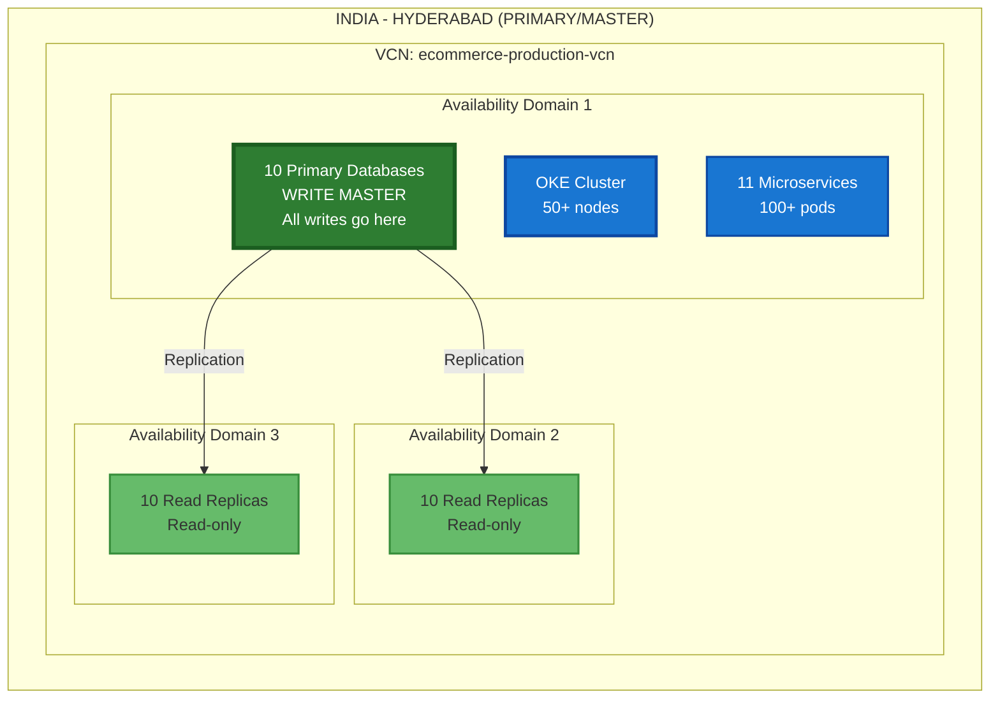

# 🇮🇳 India - Hyderabad (Primary Region)

**✅ ACTIVE - MAIN PRODUCTION REGION**

---

Hyderabad is the **primary and master region** for the e-commerce platform. All database writes go to Hyderabad, and it serves as the source of truth for all data.

## Region Details

- **Region**: IN-HYDERABAD-1 (India Central)
- **Type**: Primary/Master
- **Status**: Active Production
- **Deployment**: Complete

## Infrastructure

### Complete Production Stack

## Key Characteristics

- ✅ **Write Master**: All database writes
- ✅ **Full Infrastructure**: Complete production stack
- ✅ **High Availability**: 3 Availability Domains
- ✅ **Read Replicas**: 20 read replicas for scaling
- ✅ **Source of Truth**: All data originates here

## Database Configuration

| Database | Type | OCPUs | Storage | Replicas |
|----------|------|-------|---------|----------|
| Auth DB | Primary | 2-128 | 2TB+ | 2-5 |
| User DB | Primary | 2-128 | 2TB+ | 2-5 |
| Product DB | Primary | 2-128 | 2TB+ | 2-5 |
| Order DB | Primary | 2-128 | 2TB+ | 2-5 |
| Payment DB | Primary | 2-128 | 2TB+ | 2-5 |
| Cart DB | Primary | 2-128 | 2TB+ | 2-5 |
| Notification DB | Primary | 2-128 | 2TB+ | 2-5 |
| Discount DB | Primary | 2-128 | 2TB+ | 2-5 |
| Shipping DB | Primary | 2-128 | 2TB+ | 2-5 |
| Return DB | Primary | 2-128 | 2TB+ | 2-5 |

## Replication Targets

1. **Within Region**: AD-2 and AD-3 (Read Replicas)
2. **Cross-Region**: Russia - Moscow (Read Replicas)
3. **DR**: Mumbai (Standby)

## Traffic

- **Primary Users**: Indian users
- **Traffic Volume**: 100% of writes, 70% of reads
- **Latency**: < 10ms (within India)

---

**Next**: [11-02 Russia - Moscow (Secondary)](../11-02-russia-moscow/README.md)

