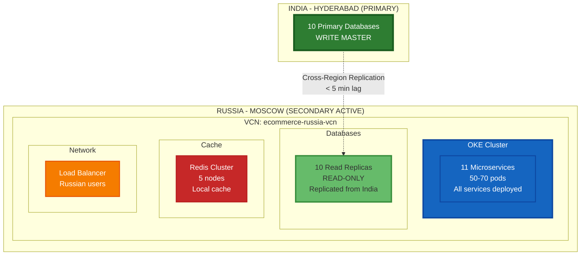
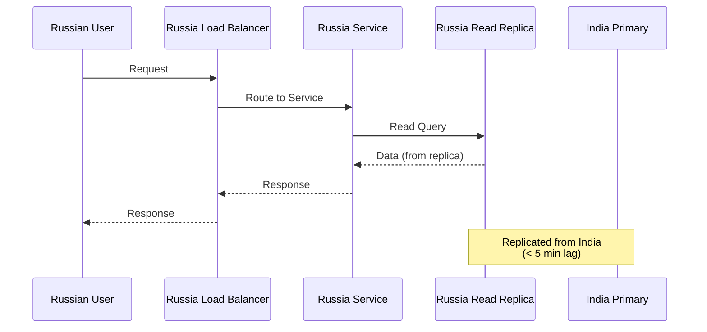
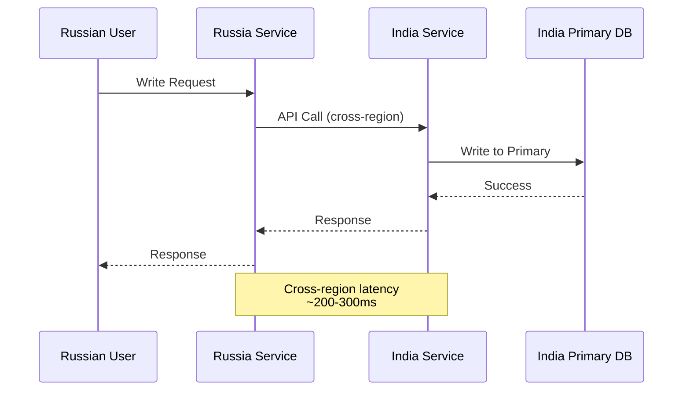
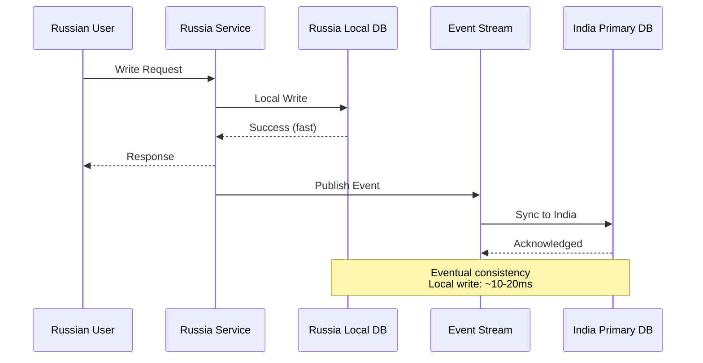

<div align="center">

# 🇷🇺 Russia - Moscow (Secondary Active Region)

[](.)
[](.)
[](.)

**🚀 TO BE DEPLOYED - SECONDARY ACTIVE REGION**

</div>

---

Moscow is the **secondary active region** for Russian users. It provides low-latency access while keeping India as the master region for all writes.

## Region Details

- **Region**: EU-MOSCOW-1 or RU-MOSCOW-1 (when available)
- **Type**: Secondary/Edge (Active)
- **Status**: To be deployed after India
- **Purpose**: Low latency for Russian users

## ⚠️ Important Clarifications

### Russia is NOT DR for India

- ❌ **Russia is NOT** the disaster recovery region for India
- ✅ **Mumbai is** the DR region for India
- ✅ **Russia is** an active secondary region for Russian users
- ✅ **Russia may have** its own DR region (separate Russian region or Mumbai)

### Data Flow

```
India (Hyderabad) → Primary Databases (Write Master)
    │
    ├─→ Replicate to → Russia (Moscow) Read Replicas
    └─→ Replicate to → Mumbai (DR Standby)
```

## Infrastructure to Deploy

### Complete Active Infrastructure



## What to Deploy in Russia

### ✅ Full Active Infrastructure

| Component | Deploy? | Configuration | Purpose |
|-----------|---------|---------------|---------|
| **OKE Cluster** | ✅ YES | 20-30 nodes | Run services locally |
| **All 11 Services** | ✅ YES | 50-70 pods | Serve Russian users |
| **Load Balancer** | ✅ YES | Regional LB | Route Russian traffic |
| **Database Read Replicas** | ✅ YES | 10 replicas | Local reads |
| **Redis Cluster** | ✅ YES | 5 nodes | Local caching |
| **OCI Streaming** | ✅ YES | Local streams | Event processing |
| **OCI Queue** | ✅ YES | Local queues | Async processing |
| **WAF** | ✅ YES | Regional | Security |
| **CDN Edge** | ✅ YES | Moscow/St. Petersburg | Static assets |

### ❌ Do NOT Deploy

| Component | Reason |
|-----------|--------|
| **Database Primaries** | India is write master |
| **Full Infrastructure** | Smaller scale than India |

## Database Configuration

| Database | Type | Source | Replication Lag | Purpose |
|----------|------|--------|------------------|---------|
| Auth DB | Read Replica | India Primary | < 5 min | Local reads |
| User DB | Read Replica | India Primary | < 5 min | Local reads |
| Product DB | Read Replica | India Primary | < 5 min | Local reads |
| Order DB | Read Replica | India Primary | < 5 min | Local reads |
| Payment DB | Read Replica | India Primary | < 5 min | Local reads |
| Cart DB | Read Replica | India Primary | < 5 min | Local reads |
| Notification DB | Read Replica | India Primary | < 5 min | Local reads |
| Discount DB | Read Replica | India Primary | < 5 min | Local reads |
| Shipping DB | Read Replica | India Primary | < 5 min | Local reads |
| Return DB | Read Replica | India Primary | < 5 min | Local reads |

## Data Flow Patterns

### Read Operations (Russia)



### Write Operations (Russia)

**Option 1: Direct Write to India (Simpler)**



**Option 2: Local Write + Sync (Better Latency)**



## Disaster Recovery for Russia

### DR Options for Russia

**Option 1: Use Mumbai as DR (Shared DR)**

```
Russia (Moscow) → Replicate to → Mumbai (DR)
India (Hyderabad) → Replicate to → Mumbai (DR)

Mumbai serves as DR for both India and Russia
```

**Option 2: Use Another Russian Region (Dedicated DR)**

```
Russia (Moscow) → Replicate to → Russia (St. Petersburg) DR
India (Hyderabad) → Replicate to → Mumbai DR

Separate DR regions for each primary
```

### Recommended: Option 1 (Mumbai as Shared DR)

**Benefits**:
- ✅ Cost-effective (one DR region)
- ✅ Simpler management
- ✅ Mumbai can handle both regions

**Configuration**:
- Mumbai has standby databases for both India and Russia
- During DR: Activate appropriate standby based on which region failed

## Deployment Checklist

### Phase 1: Infrastructure Setup
- [ ] Create VCN in Russia region
- [ ] Set up OKE cluster (20-30 nodes)
- [ ] Configure load balancer
- [ ] Set up networking (cross-region connectivity)

### Phase 2: Database Setup
- [ ] Create 10 read replicas (replicated from India)
- [ ] Configure replication monitoring
- [ ] Set up backup strategy

### Phase 3: Services Deployment
- [ ] Deploy all 11 microservices
- [ ] Configure service discovery
- [ ] Set up Redis cluster
- [ ] Configure OCI Streaming/Queue

### Phase 4: Global Services
- [ ] Configure Global DNS (route Russian users to Russia)
- [ ] Set up CDN edge locations in Russia
- [ ] Configure WAF for Russia region
- [ ] Set up monitoring and alerts

### Phase 5: Testing
- [ ] Test read operations from Russia
- [ ] Test write operations (to India)
- [ ] Test failover scenarios
- [ ] Load testing

## Cost Estimate

| Component | Monthly Cost |
|-----------|--------------|
| OKE Cluster (30 nodes) | $12,000 |
| Database Read Replicas (10) | $8,000 |
| Services (70 pods) | $6,000 |
| Redis Cluster (5 nodes) | $1,500 |
| Load Balancer | $500 |
| Networking (cross-region) | $1,500 |
| CDN/DNS | $1,000 |
| **Total** | **$30,500/month** |

## Monitoring

### Key Metrics

| Metric | Threshold | Action |
|--------|-----------|--------|
| Replication Lag | > 10 minutes | Alert DevOps |
| Service Latency | > 500ms | Scale up services |
| Database CPU | > 80% | Scale up database |
| Cross-region Connectivity | Down | Critical Alert |

## Summary

- ✅ **Russia is ACTIVE**: Full infrastructure for Russian users
- ✅ **India is MASTER**: All writes go to India
- ✅ **Mumbai is DR**: For India (can also serve as DR for Russia)
- ✅ **Low Latency**: Russian users get < 50ms latency
- ✅ **Read Replicas**: All reads from Russia go to local replicas
- ✅ **Write Strategy**: Writes go to India (or local write + sync)

---

**Related**:
- [11-01 India - Hyderabad (Primary)](../11-01-india-hyderabad/README.md)
- [11-03 India - Mumbai (DR)](../11-03-india-mumbai/README.md)
- [Multi-Region Overview](../README.md)

