<div align="center">

# 🇮🇳 India - Mumbai (Disaster Recovery Region)

[](.)
[](.)
[](.)

**✅ STANDBY - DR FOR INDIA REGION**

</div>

---

Mumbai is the **disaster recovery (DR) region** for the India (Hyderabad) primary region. It provides regional disaster recovery protection.

## Region Details

- **Region**: IN-MUMBAI-1 (India West)
- **Type**: Disaster Recovery (Standby)
- **Status**: Standby (minimal infrastructure)
- **Purpose**: DR for India region

## ⚠️ Important Clarifications

### Mumbai is DR for India, NOT for Russia

- ✅ **Mumbai is DR** for India (Hyderabad)
- ❌ **Mumbai is NOT** the primary region
- ✅ **Mumbai can serve** as DR for Russia (optional, shared DR)
- ✅ **Mumbai is STANDBY**: Minimal infrastructure until DR activation

### DR Hierarchy

```
Primary: India (Hyderabad) → DR: Mumbai
Secondary: Russia (Moscow) → DR: Mumbai (shared) OR Russia (St. Petersburg)
```

## Infrastructure

### Minimal Standby Infrastructure


## What is Deployed in Mumbai

### ✅ Always Running (Standby)

| Component | Configuration | Purpose |
|-----------|--------------|---------|
| **Standby Databases** | 10 databases (read-only) | DR data protection |
| **Backup Storage** | Cross-region backups | Data safety |
| **Monitoring** | Health checks | DR readiness |

### ❌ Scale Up On Demand (During DR)

| Component | When Activated | Purpose |
|-----------|----------------|---------|
| **OKE Cluster** | During DR failover | Run services |
| **Services** | During DR failover | Serve traffic |
| **Load Balancer** | During DR failover | Route traffic |
| **Redis** | During DR failover | Caching |

## Database Configuration

| Database | Type | Source | Replication Lag | Failover Time |
|----------|------|--------|------------------|---------------|
| Auth DB Standby | Standby | India Primary | < 15 min | < 30 min |
| User DB Standby | Standby | India Primary | < 15 min | < 30 min |
| Product DB Standby | Standby | India Primary | < 15 min | < 30 min |
| Order DB Standby | Standby | India Primary | < 15 min | < 30 min |
| Payment DB Standby | Standby | India Primary | < 15 min | < 30 min |
| Cart DB Standby | Standby | India Primary | < 15 min | < 30 min |
| Notification DB Standby | Standby | India Primary | < 15 min | < 30 min |
| Discount DB Standby | Standby | India Primary | < 15 min | < 30 min |
| Shipping DB Standby | Standby | India Primary | < 15 min | < 30 min |
| Return DB Standby | Standby | India Primary | < 15 min | < 30 min |

## DR Scenarios

### Scenario 1: India (Hyderabad) Region Failure

```mermaid
sequenceDiagram
    participant Ops as DevOps Team
    participant Mumbai as Mumbai DR
    participant Services as OKE Services
    participant Users as Users
    
    Note over Ops: India region fails
    Ops->>Mumbai: Activate DR (Promote Standby)
    Mumbai->>Mumbai: Standby → Primary (read-write)
    Ops->>Services: Scale up OKE cluster
    Ops->>Services: Deploy all services
    Ops->>Users: Update DNS (route to Mumbai)
    Services->>Mumbai: Connect to Mumbai databases
    Mumbai-->>Services: Service restored
    Users->>Services: Traffic routed to Mumbai
    
    Note over Mumbai,Services: RTO: < 1 hour<br/>RPO: < 15 minutes
```



### Scenario 2: Russia Region Failure (If Mumbai is DR for Russia)


## DR Activation Procedure

### Step-by-Step Failover

1. **Detection** (Automatic)
   - Monitoring detects region failure
   - Alerts DevOps team

2. **Decision** (Manual)
   - Assess situation
   - Decide to activate DR

3. **Database Promotion** (5-10 minutes)
   - Promote standby databases to primary
   - Verify data integrity
   - Check replication lag

4. **Infrastructure Scale-Up** (20-30 minutes)
   - Create/scale OKE cluster
   - Deploy all services
   - Configure load balancer
   - Set up Redis cluster

5. **Traffic Routing** (5-10 minutes)
   - Update DNS records
   - Update load balancer configuration
   - Verify connectivity

6. **Verification** (10-15 minutes)
   - Test critical services
   - Verify data integrity
   - Monitor performance

**Total RTO**: < 1 hour

## Cost Estimate

| Component | Monthly Cost | Notes |
|-----------|--------------|-------|
| Standby Databases (10) | $2,000 | Always running |
| Backup Storage | $500 | Cross-region backups |
| Monitoring | $100 | Health checks |
| **Standby Cost** | **$2,600/month** | Minimal |
| **DR Activation Cost** | +$50,000/month | Full infrastructure during DR |

## Monitoring

### Key Metrics

| Metric | Threshold | Action |
|--------|-----------|--------|
| Replication Lag | > 20 minutes | Alert DevOps |
| Standby Database Status | Down | Critical Alert |
| India Region Status | Down | Initiate DR |
| Cross-region Connectivity | Down | Critical Alert |

## Summary

- ✅ **Mumbai is DR**: Standby for India (Hyderabad)
- ✅ **Minimal Infrastructure**: Only databases running (standby)
- ✅ **Scale on Demand**: Full infrastructure during DR activation
- ✅ **Shared DR Option**: Can also serve as DR for Russia
- ✅ **RTO**: < 1 hour
- ✅ **RPO**: < 15 minutes

---

**Related**:
- [11-01 India - Hyderabad (Primary)](../11-01-india-hyderabad/README.md)
- [11-02 Russia - Moscow (Secondary)](../11-02-russia-moscow/README.md)
- [Multi-Region Overview](../README.md)

