# 🌍 Master Multi-Region Architecture Diagram

**Complete visual representation of the multi-region deployment**

---

Complete visual representation of the multi-region deployment with India as primary, Russia as secondary, and Mumbai as DR.

## Complete Multi-Region Architecture

## Region Comparison Table

| Aspect | India (Hyderabad) | Russia (Moscow) | Mumbai (DR) |
|--------|-------------------|-----------------|-------------|
| **Type** | Primary/Master | Secondary/Active | DR/Standby |
| **Status** | ✅ Active | 🚀 To Deploy | ✅ Standby |
| **OKE Cluster** | 50+ nodes | 30 nodes | Scale on demand |
| **Services** | 100+ pods | 70 pods | Deploy on DR |
| **Databases** | 10 Primary (Write) | 10 Read Replicas | 10 Standby |
| **Read Replicas** | 20 (within region) | 0 (is replica) | 0 |
| **Traffic** | Indian users | Russian users | None (until DR) |
| **Write Operations** | ✅ All writes | ❌ No writes | ❌ No writes |
| **Cost** | $50,000/month | $30,000/month | $2,600/month |

## Data Flow Diagram

## Replication Topology

## Disaster Recovery Scenarios

```mermaid
graph TB
    subgraph Normal["NORMAL OPERATION"]
        IndiaNormal["India: Active<br/>100% traffic"]
        RussiaNormal["Russia: Active<br/>Russian users"]
        MumbaiNormal["Mumbai: Standby<br/>No traffic"]
    end
    
    subgraph Scenario1["SCENARIO 1: India Region Fails"]
        IndiaFail["India: DOWN<br/>❌ Region failure"]
        RussiaContinue["Russia: Continue<br/>✅ Still active"]
        MumbaiActivate["Mumbai: ACTIVATE<br/>🚀 Promote to Primary<br/>RTO < 1 hour"]
    end
    
    subgraph Scenario2["SCENARIO 2: Russia Region Fails"]
        IndiaContinue["India: Continue<br/>✅ Still active"]
        RussiaFail["Russia: DOWN<br/>❌ Region failure"]
        MumbaiOption["Mumbai: OPTION<br/>Can activate Russia DR<br/>OR use another Russian region"]
    end
    
    Normal -->|"India fails"| Scenario1
    Normal -->|"Russia fails"| Scenario2
    
    style IndiaNormal fill:#4caf50,stroke:#2e7d32,stroke-width:3px,color:#ffffff
    style IndiaFail fill:#d32f2f,stroke:#c62828,stroke-width:3px,color:#ffffff
    style RussiaNormal fill:#42a5f5,stroke:#1976d2,stroke-width:3px,color:#ffffff
    style RussiaFail fill:#d32f2f,stroke:#c62828,stroke-width:3px,color:#ffffff
    style MumbaiNormal fill:#757575,stroke:#616161,stroke-width:2px,color:#ffffff
    style MumbaiActivate fill:#ff6f00,stroke:#e65100,stroke-width:4px,color:#ffffff
```

## Key Points Summary

### ✅ India (Hyderabad) - PRIMARY/MASTER
- **Role**: Write master, main production
- **Infrastructure**: Full (50+ nodes, 100+ pods)
- **Databases**: 10 Primary (write) + 20 Read Replicas
- **Traffic**: Indian users
- **Status**: ✅ Active

### 🚀 Russia (Moscow) - SECONDARY ACTIVE
- **Role**: Active region for Russian users
- **Infrastructure**: Full (30 nodes, 70 pods)
- **Databases**: 10 Read Replicas (read-only from India)
- **Traffic**: Russian users
- **Status**: To be deployed after India

### ✅ Mumbai - DR STANDBY
- **Role**: Disaster recovery for India
- **Infrastructure**: Minimal (databases only, scale on demand)
- **Databases**: 10 Standby (replicated from India)
- **Traffic**: None (until DR activation)
- **Status**: ✅ Standby
- **Can also serve**: As DR for Russia (optional)

## Replication Summary

| Replication Path | Type | Lag | Purpose |
|------------------|------|-----|---------|
| India Primary → India RR (AD-2) | Within Region | < 1 sec | Fault tolerance |
| India Primary → India RR (AD-3) | Within Region | < 1 sec | Fault tolerance |
| India Primary → Russia RR | Cross-Region | < 5 min | Low latency reads |
| India Primary → Mumbai Standby | Cross-Region | < 15 min | Disaster recovery |
| Russia RR → Mumbai Standby | Cross-Region | < 15 min | Optional DR for Russia |

---

**Next Steps**:
- [11-01 India - Hyderabad Details](./11-01-india-hyderabad/README.md)
- [11-02 Russia - Moscow Details](./11-02-russia-moscow/README.md)
- [11-03 India - Mumbai Details](./11-03-india-mumbai/README.md)

